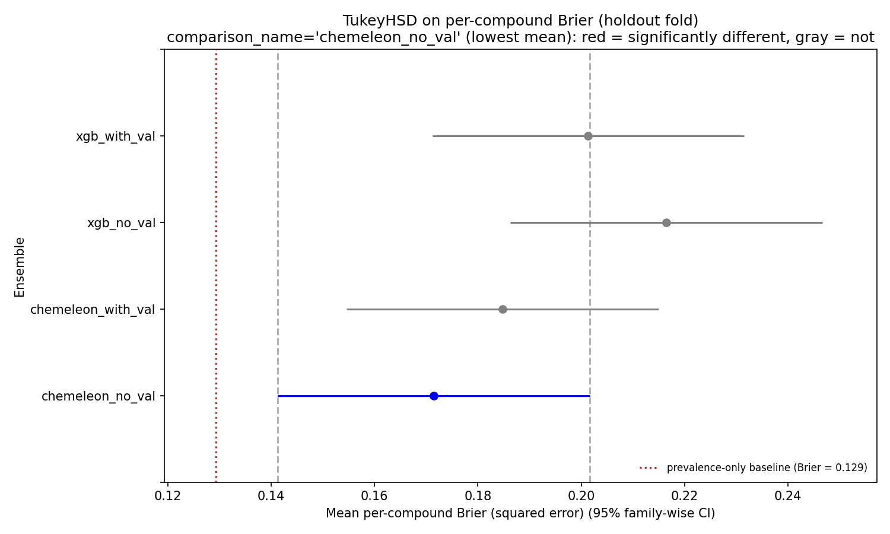
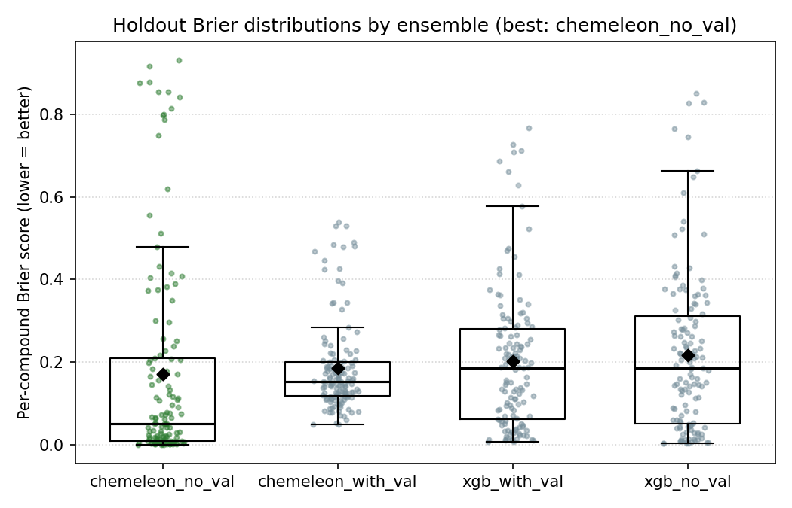
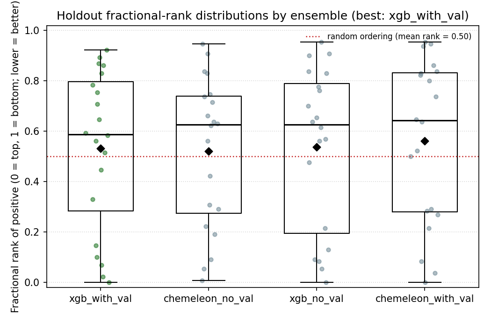
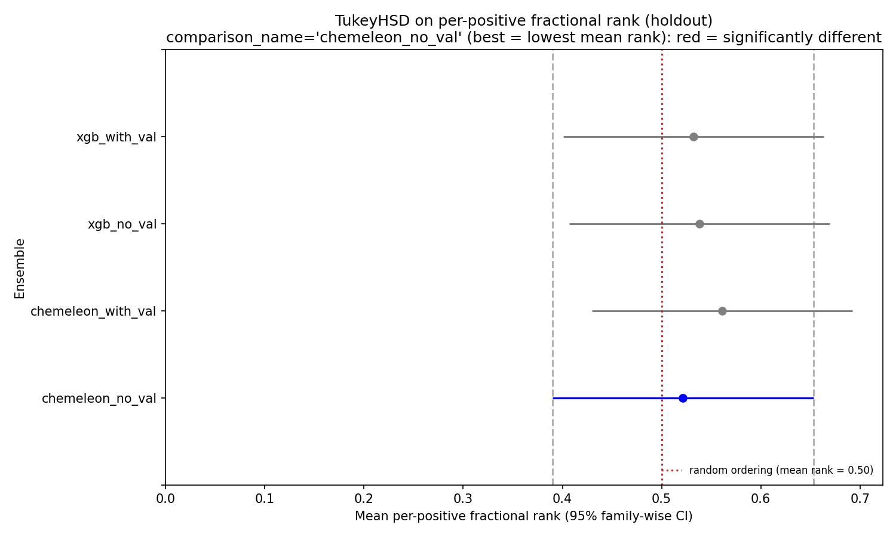

# classification-models-try1-rjg

First pass at binary binder/non-binder classification for TBXT. Four model
variants trained on the same 6 chemical-space folds
(see [folds-pacmap-kmeans6](../folds-pacmap-kmeans6/README.md)),
compared on a structurally distinct holdout fold with TukeyHSD.

Author: rjg. Date: 2026-05-08.

## TL;DR

- Best ensemble by holdout Brier is **chemeleon_no_val** (4-fold training,
  15 fixed epochs, no early stopping). OOF AUROC 0.655, holdout AUROC 0.475.
- **None of the four ensembles is statistically distinguishable** on the
  held-out fold (TukeyHSD, all p-adj > 0.22). Smallest gap is between
  chemeleon_no_val and xgb_no_val (meandiff 0.045).
- **All four ensembles underperform a prevalence-only baseline** on the
  distinct holdout fold (baseline Brier 0.129, best model 0.171). This is
  the honest result: models built on the five CV folds do not extrapolate
  to the structurally distinct sixth fold.
- Dropping the validation split (training on 4 folds instead of 3, with a
  fixed epoch / tree count) slightly helps the chemeleon variant on both
  OOF and holdout Brier, but slightly hurts XGBoost.

## Task

Binary classifier: `pKD >= 3.837` (top quartile, ~KD ≤ 146 µM) = binder.
1,599 labeled compounds, 400 positives (25.0%) overall.

Hold out fold 4 (131 compounds, 20 positives, 15.3% prevalence) as an
out-of-domain evaluation set. Train 5-model ensembles on the remaining
five folds (1,468 compounds, 380 positives).

## Ensembles compared

| Name | Model | Fold role per CV run | Regularization signal |
|---|---|---|---|
| `chemeleon_with_val` | CheMeleon encoder (8.7 M params) + 2-hidden-layer classifier FFN (278 K params) | 3 train / 1 val / 1 test, rotate | Early stop on val loss (patience 10, max 60 epochs) |
| `chemeleon_no_val` | same architecture | 4 train / 1 test, rotate | Fixed 15 epochs (median best-epoch from val variant) |
| `xgb_with_val` | XGBoost on Morgan FP (2048) ⊕ physchem (8) | 3 train / 1 val / 1 test, rotate | `early_stopping_rounds=30` on val log loss |
| `xgb_no_val` | same features | 4 train / 1 test, rotate | Fixed `n_estimators=100` (median best_iter from val variant) |

Rationale for the no-val variants: the val-variant's best-epoch (chemprop)
or best-iteration (xgb) clustered tightly across folds, so a fixed training
budget at the median recovers most of the early-stop benefit while
reclaiming the 20–25 % of training data that was being used as a held-out
val split.

## CV out-of-fold (OOF) performance

Scoring on the 1,468 non-holdout compounds by aggregating each model's
predictions on its own rotated test fold.

| Ensemble | OOF AUROC | OOF AUPRC |
|---|---:|---:|
| chemeleon_with_val | 0.608 | 0.357 |
| chemeleon_no_val | **0.655** | **0.404** |
| xgb_with_val | 0.632 | 0.351 |
| xgb_no_val | 0.632 | 0.364 |

Class prevalence on the non-holdout pool is 25.9 %, so a random classifier
baseline AUPRC is 0.259. All four models comfortably beat random on CV.

## Holdout performance (fold 4, n=131, 20 positives)

| Ensemble | Mean Brier ↓ | AUROC | AUPRC |
|---|---:|---:|---:|
| prevalence-only baseline | 0.129 | 0.500 | 0.153 |
| chemeleon_no_val (**best**) | **0.171** | 0.475 | 0.177 |
| chemeleon_with_val | 0.185 | 0.428 | 0.198 |
| xgb_with_val | 0.201 | 0.463 | 0.223 |
| xgb_no_val | 0.217 | 0.455 | 0.211 |

All four models are *worse* than a constant-prevalence prediction
(Brier = p·(1–p) with p = 0.153) on this fold. AUROCs ≤ 0.5 for three
of four variants confirm the models assign roughly random rank ordering
on out-of-domain scaffolds.

### TukeyHSD on per-compound Brier

Each holdout compound contributes one Brier value per ensemble (squared
error against its 0/1 label). TukeyHSD at FWER = 0.05 on the resulting
(131 × 4 = 524) values tests whether mean-Brier differences across
ensembles are significant.

| group1 | group2 | meandiff | p-adj | 95 % CI | reject |
|---|---|---:|---:|---:|:---:|
| chemeleon_no_val | chemeleon_with_val | 0.013 | 0.942 | [–0.047, 0.074] | no |
| chemeleon_no_val | xgb_no_val | 0.045 | 0.221 | [–0.015, 0.105] | no |
| chemeleon_no_val | xgb_with_val | 0.030 | 0.579 | [–0.031, 0.090] | no |
| chemeleon_with_val | xgb_no_val | 0.032 | 0.529 | [–0.029, 0.092] | no |
| chemeleon_with_val | xgb_with_val | 0.017 | 0.894 | [–0.044, 0.077] | no |
| xgb_no_val | xgb_with_val | –0.015 | 0.917 | [–0.076, 0.045] | no |

All six pairs fail to reject. Smallest p-adj (0.221) is chemeleon_no_val
vs. xgb_no_val — the direction a future larger holdout might resolve.



Statsmodels' built-in `plot_simultaneous(comparison_name="chemeleon_no_val")`:
the comparison group is blue, groups significantly different from it would
be red (none here). Red dotted line is the prevalence-only Brier baseline.

### Per-compound Brier distributions



All four distributions overlap heavily. Black diamond = mean, box = IQR,
whiskers = 1.5×IQR, points = per-compound Briers with jitter. The best
ensemble (green) sits a hair lower but well within the spread of the
others.

### Rank of positive (preferred comparison metric, added post-hoc)

Brier treats positives and negatives symmetrically, so with only 20
positives vs. 111 negatives the mean is dominated by negative-class
calibration. For the deployment task (pick top-K from 3.4B), what
matters is how high in the ranking each true positive lands.

Each of the 20 holdout positives gets a **fractional rank** =
(# compounds scored higher) / (N – 1). Bounded [0, 1]; 0 = top,
1 = bottom; 0.5 = random ordering.

| Ensemble | Mean rank | Median rank |
|---|---:|---:|
| random-ordering baseline | 0.500 | 0.500 |
| chemeleon_no_val | 0.522 | 0.627 |
| xgb_with_val     | 0.532 | 0.588 |
| xgb_no_val       | 0.538 | 0.627 |
| chemeleon_with_val | 0.561 | 0.642 |

**All four mean ranks are at or above 0.5.** Under the try1 top-quartile
label, none of the ensembles rank fold-4 positives any better than
random on average — the label was too noisy to teach transferable
ordering. This matches the AUROC ≈ 0.5 finding above and makes the
holdout result honest in a way that Brier (which rewarded all four for
predicting low probabilities) did not.





Both TukeyHSD (unpaired, all p-adj > 0.97) and paired Wilcoxon
signed-rank (all p > 0.57 across 6 pairs) fail to reject.
Consistent with the Brier finding — on this holdout under this label,
models are not distinguishable **because none of them generalized**.

See [try2](../classification-models-try2-rjg/README.md) and
[try3](../classification-models-try3-rjg/README.md) for how cleaner
labels + better holdout composition flip this result.

## What this says

1. **The holdout fold is out-of-domain.** We picked the most structurally
   distinct fold on purpose; AUROCs near 0.5 on it are the expected
   outcome of a model that has learned within-cluster structure but not
   cross-cluster generalization.
2. **Chemeleon's foundation weights give a modest OOF edge** (AUROC 0.655
   vs. XGB's 0.632) but that edge does not carry over to the held-out
   fold, and it isn't statistically distinguishable from XGB after Tukey
   correction.
3. **Dropping the val split was a reasonable trade** for chemeleon
   (+0.05 OOF AUROC, +0.05 holdout AUROC) but not for XGB
   (~tie OOF, –0.01 holdout AUROC). The gradient-boosted tree ensemble
   appears to benefit more from genuine early stopping than from seeing
   the extra 20 % of training data.
4. **The n=131 holdout is too small to adjudicate small Brier differences.**
   Tukey's family-wise CIs are ±0.06 Brier wide while the full range of
   means is only 0.04 wide, so nothing can be significant at this sample
   size.

## Next steps (low-hanging)

- Bootstrap holdout AUROC/Brier for a tighter comparison with per-seed
  resampling. Tukey on 131 compounds is underpowered; 1,000 bootstrap
  replicates gives sub-0.01 Brier resolution.
- Evaluate on the larger 1,468-compound OOF set (which has ~11× the
  sample size of the holdout and is already computed). That's still a
  within-clusters evaluation, but it has real power to rank models.
- Run a *less distinct* holdout (fold 3 or 5) to see whether models
  that look indistinguishable on fold 4 separate when the holdout is
  more realistic.
- Train a larger ensemble (≥10 seeds per variant) so Tukey has enough
  replicates to actually resolve the small effect sizes.

## Reproduce

Run in order from the repo root. Each step is idempotent and reads from
the artifacts of the previous step.

```bash
# 1. label compounds (top-quartile pKD -> is_binder)
uv run python scripts/01_make_labels.py

# 2. build chemical-space folds (see folds-pacmap-kmeans6/)
uv run python scripts/folds-pacmap-kmeans6/02_make_folds.py

# 3-6. train each ensemble (MPS takes ~30 min for chemeleon, ~1 s for xgb)
uv run python scripts/classification-models-try1-rjg/03_train_cv.py --accelerator mps
uv run python scripts/classification-models-try1-rjg/04_xgb_cv.py
uv run python scripts/classification-models-try1-rjg/05_chemeleon_novalid_cv.py --accelerator mps --epochs 15
uv run python scripts/classification-models-try1-rjg/06_xgb_novalid_cv.py --n-estimators 100

# 7. compare + TukeyHSD + plots
uv run python scripts/classification-models-try1-rjg/07_compare_ensembles.py

# 8. rank-based comparison (added post-hoc; preferred for deployment)
uv run python scripts/classification-models-try1-rjg/08_compare_ensembles_by_rank.py
```

## Artifacts

```
data/classification-models-try1-rjg/
├── chemeleon_with_val_cv_fold_{0,1,2,3,5}/      # best-val Lightning checkpoints
├── chemeleon_no_val_cv_fold_{0,1,2,3,5}.ckpt    # final-epoch Lightning checkpoints
├── xgb_{with,no}_val_cv_fold_{0,1,2,3,5}.ubj    # xgboost boosters (UBJSON)
├── {chemeleon,xgb}_{with,no}_val_oof.csv        # OOF predictions per compound
├── {chemeleon,xgb}_{with,no}_val_holdout.csv    # holdout predictions per compound + ensemble mean
├── {chemeleon,xgb}_{with,no}_val_metrics.json   # per-run and aggregate metrics, with model paths
├── holdout_comparison_brier.csv                 # wide per-compound Brier, one col per ensemble
├── holdout_comparison_summary.json              # ensemble means, TukeyHSD pairs, baseline
└── holdout_tukey_hsd.txt                        # statsmodels TukeyHSD summary table
```

Model checkpoints are tracked via **git-lfs** (`*.ckpt`, `*.ubj`). Make sure
you have `git-lfs` installed and `git lfs install` has been run locally
before cloning or pulling fresh model files. Chemeleon `.ckpt` files are
~107 MB each; xgboost `.ubj` files are 130–270 KB each.

### Rehydrating saved models

```python
from chemprop.models import MPNN
from tbxt_hackathon.xgb_baseline import load_xgb_model

# chemeleon
cm = MPNN.load_from_checkpoint("data/classification-models-try1-rjg/chemeleon_no_val_cv_fold_0.ckpt")

# xgboost
xgb = load_xgb_model("data/classification-models-try1-rjg/xgb_with_val_cv_fold_0.ubj")
```

## Configuration

**chemeleon** (both variants):
- encoder: CheMeleon pretrained `BondMessagePassing` (2048-dim output)
- head: 2 hidden layers × 256 units, ReLU, dropout 0.2, binary output
- optimizer: AdamW, NoamLR schedule (init_lr 1e-7, max_lr 1e-3, final_lr 1e-7), batch 32
- val variant: max 60 epochs, patience 10, monitor val loss
- no-val variant: 15 epochs fixed, no checkpoint
- accelerator: Apple MPS

**xgboost** (both variants):
- features: Morgan FP (2048, r=2) ⊕ physchem (mw, logp, hbd, hba, heavy_atoms, num_rings, tpsa, rotatable_bonds)
- hist tree method, max_depth 6, lr 0.05, subsample 0.9, colsample_bytree 0.6
- `scale_pos_weight = n_neg / n_pos` per fold
- val variant: up to 1,000 trees, `early_stopping_rounds=30` on val log loss
- no-val variant: 100 trees fixed

Seed = 0 throughout.
