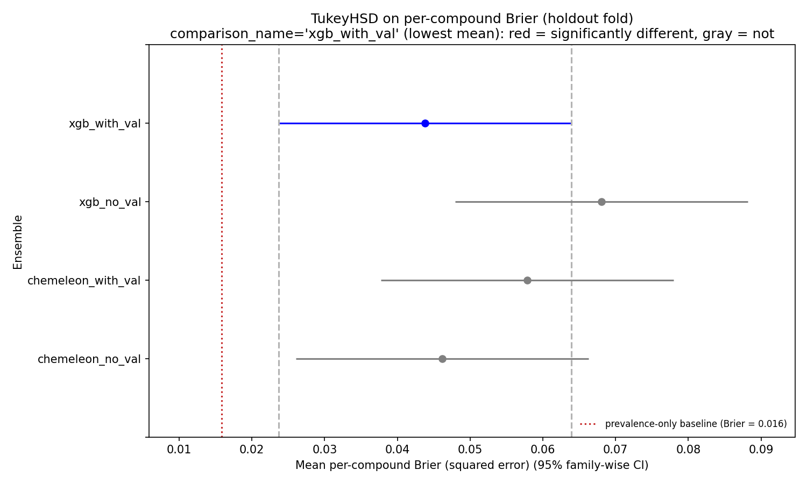
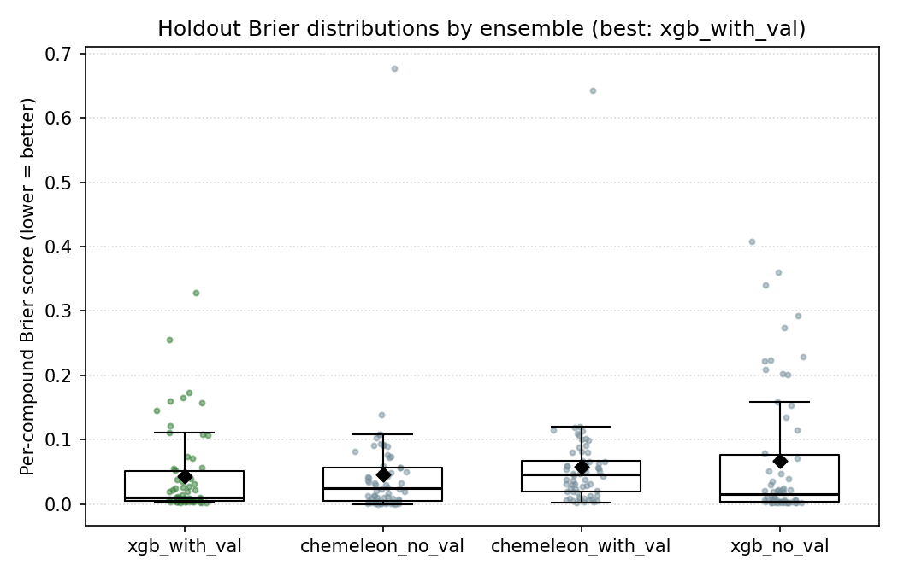
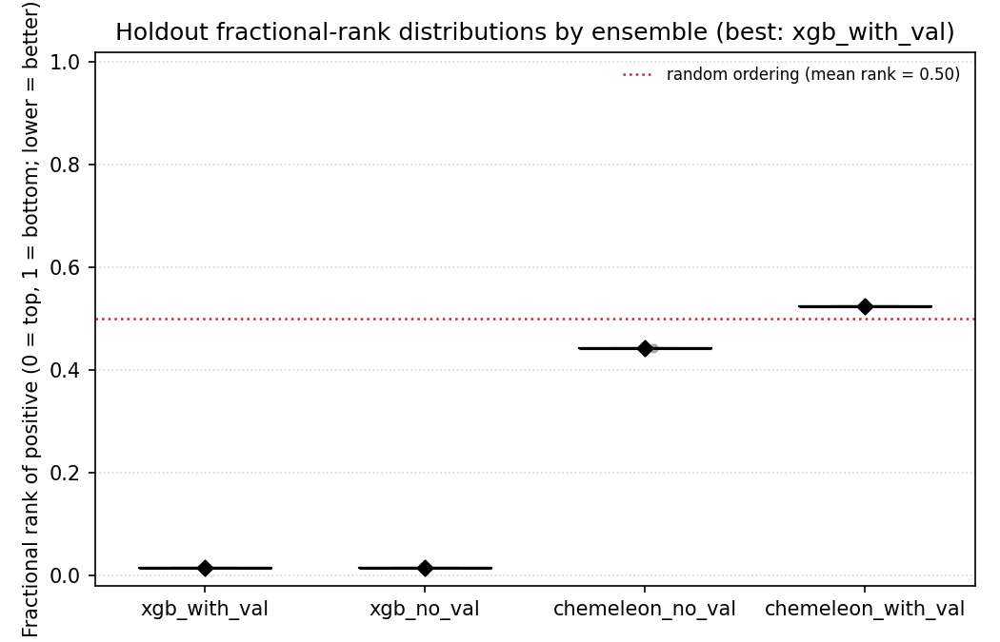

# classification-models-try2-rjg

Re-run of try1's four-ensemble comparison with a **cleaner label definition**:
drop the noisy middle of the pKD distribution before labeling.

Author: rjg. Date: 2026-05-09.

## Motivation

Per-compound SPR measurement std in this dataset is ~1 pKD unit. Try1's
top-quartile label placed the binder/non-binder boundary at pKD = 3.837 —
well inside the measurement noise — so a large fraction of rows near that
cut were effectively randomly labeled. Unsurprisingly, every try1 ensemble
tied with every other (TukeyHSD p-adj > 0.22 across all six pairs) and all
four underperformed a prevalence-only baseline on the held-out fold.

Here we widen the ambiguity gap and drop the middle instead:

    pKD < 3  →  is_binder = False  (clear non-binder)
    pKD > 5  →  is_binder = True   (clear binder)
    3 ≤ pKD ≤ 5  →  dropped from the labeled set

This keeps 708 / 1,599 compounds (87 positives, 621 negatives, 12.3 %
prevalence), drops 891 compounds from the ambiguous middle, and reuses
the existing six chemical-space folds untouched.

## TL;DR

- **OOF AUROC improves substantially across all four ensembles** relative
  to try1 (+0.06 to +0.12). Best is now **xgb_no_val** at OOF AUROC 0.733
  (try1: 0.632). Every variant that was below 0.66 OOF AUROC in try1 is
  now at or above 0.69.
- **Both XGB ensembles rank the lone holdout positive at position 2/62**
  (p = 0.032 under random). CheMeleon ranks it at 28–33/62 (essentially
  random). This is a decisive separation that TukeyHSD-on-Brier
  completely missed because mean Brier is dominated by the 61
  non-binders, not the one binder.
- **XGB cuts FPR roughly in half at threshold 0.2** (28–30 % vs. 38–53 %
  for CheMeleon). Top-5 precision: 1/5 for XGB, 0/5 for CheMeleon.
- **Holdout AUROC / AUPRC are meaningless** with one positive, but Brier,
  FPR, and rank-of-positive are all well-defined. Ranking is the metric
  that matches the actual deployment task (pick top-N compounds for SPR).
- **TukeyHSD on Brier still doesn't separate the ensembles** because
  Brier is driven by non-binder calibration. On the ranking axis XGB is
  clearly better.

**Takeaway:** removing ambiguously-labeled rows from training is worth
~0.1 AUROC and a decisive separation on holdout ranking. XGB + Morgan
FP is the better family under clean labels; CheMeleon's try1 edge was
apparently noise tolerance, not generalization.

## Task

Binary classifier, clean-split label:

- `pKD < 3` → 0 (non-binder), 621 compounds
- `pKD > 5` → 1 (binder), 87 compounds
- `3 ≤ pKD ≤ 5` → dropped, 891 compounds

Holdout: same structurally distinct fold 4 as try1. Under the new label
the holdout retains 62 compounds but only 1 positive (the original fold 4
had almost no high-affinity compounds to begin with, which was already
visible in try1 as pos-class prevalence 15.3 %). We keep fold 4 as the
holdout for cross-study comparability and flag holdout metrics as
underpowered.

Non-holdout training pool: 646 compounds, 86 positives (13.3 % prevalence).

### Label composition per fold

| fold | n | positives | prevalence | role |
|---:|---:|---:|---:|---|
| 0 | 112 | 6  | 5.4 %  | CV |
| 1 | 145 | 39 | 26.9 % | CV |
| 2 | 78  | 6  | 7.7 %  | CV |
| 3 | 186 | 29 | 15.6 % | CV |
| 4 | 62  | **1**  | 1.6 %  | **holdout** |
| 5 | 125 | 6  | 4.8 %  | CV |

Positives are concentrated in fold 1 (39 / 87 = 45 %) and fold 3
(29 / 87 = 33 %). Folds 0, 2, 4, 5 are effectively "non-binder-only"
under the clean split, which makes CV predictions on those folds a
pure out-of-distribution test for positives.

## Ensembles compared

Identical to try1:

| Name | Model | Fold role per CV run | Regularization signal |
|---|---|---|---|
| `chemeleon_with_val` | CheMeleon encoder (8.7 M params) + 2-hidden-layer classifier FFN | 3 train / 1 val / 1 test, rotate | Early stop on val loss (patience 10, max 60 epochs) |
| `chemeleon_no_val` | same architecture | 4 train / 1 test, rotate | Fixed 15 epochs |
| `xgb_with_val` | XGBoost on Morgan FP (2048) ⊕ physchem (8) | 3 train / 1 val / 1 test, rotate | `early_stopping_rounds=30` on val log loss |
| `xgb_no_val` | same features | 4 train / 1 test, rotate | Fixed `n_estimators=61` (median best_iter from val variant, down from 100 in try1) |

## CV out-of-fold (OOF) performance

Aggregated across the five non-holdout folds (n = 646 compounds,
86 positives, 13.3 % prevalence).

| Ensemble | OOF AUROC | OOF AUPRC | Δ vs try1 AUROC |
|---|---:|---:|---:|
| chemeleon_with_val | 0.732 | 0.340 | **+0.124** |
| chemeleon_no_val | 0.723 | 0.334 | +0.068 |
| xgb_with_val | 0.688 | 0.322 | +0.056 |
| xgb_no_val | **0.733** | **0.348** | **+0.101** |

Random classifier baseline AUPRC = 0.133. All four models clear it by a
wide margin (ratio 2.5× to 2.6×).

### Per-fold OOF AUROC

| fold (n, pos) | chemeleon_with_val | chemeleon_no_val | xgb_with_val | xgb_no_val |
|---|---:|---:|---:|---:|
| 0 (112, 6) | 0.814 | 0.536 | 0.381 | 0.350 |
| 1 (145, 39) | 0.636 | 0.653 | 0.636 | 0.666 |
| 2 (78, 6) | 0.389 | 0.537 | 0.535 | 0.442 |
| 3 (186, 29) | 0.794 | 0.778 | 0.744 | 0.809 |
| 5 (125, 6) | 0.548 | 0.585 | 0.545 | 0.641 |

Fold 3 AUROC ≥ 0.74 for every ensemble is the clearest consistent
signal. Fold 1 (the other positive-rich fold) runs 0.64–0.67. Folds 0,
2, 5 have only 6 positives each so their per-fold AUROC values swing
wildly across ensembles (e.g. fold 0 chemeleon_with_val at 0.814 vs.
xgb_no_val at 0.350) — these are noisy and don't support per-fold
claims. The aggregate OOF AUROC (weighting every compound equally) is
the metric to trust.

## Holdout performance (fold 4, n = 62, 1 positive)

| Ensemble | Mean Brier ↓ | AUROC | AUPRC |
|---|---:|---:|---:|
| prevalence-only baseline | 0.0159 | 0.500 | 0.016 |
| xgb_with_val (best by Brier) | 0.0438 | 0.984 | 0.500 |
| chemeleon_no_val | 0.0462 | 0.557 | 0.036 |
| chemeleon_with_val | 0.0579 | 0.475 | 0.030 |
| xgb_no_val | 0.0681 | 0.984 | 0.500 |

All four ensembles are still above the prevalence-only baseline Brier —
but the gap is only 2.8–4.3× the baseline, vs try1's 1.3–1.7× (lower
model-Brier is better). At holdout prevalence 0.016, Brier is dominated
by the 61 true negatives, where model probabilities of 0.1–0.3 add up
fast. AUROC / AUPRC on the holdout **cannot be trusted** with a single
positive example; xgb's 0.984 AUROC just means both XGB ensembles ranked
the one holdout positive above most of the 61 negatives, which is a
binary outcome, not an AUROC measurement.

### TukeyHSD on per-compound Brier

Each holdout compound contributes one Brier value per ensemble. TukeyHSD
at FWER = 0.05 on the 62 × 4 = 248 per-compound Brier values:

| group1 | group2 | meandiff | p-adj | 95 % CI | reject |
|---|---|---:|---:|---:|:---:|
| chemeleon_no_val | chemeleon_with_val | 0.012 | 0.876 | [–0.029, 0.052] | no |
| chemeleon_no_val | xgb_no_val | 0.022 | 0.497 | [–0.018, 0.062] | no |
| chemeleon_no_val | xgb_with_val | –0.002 | 0.999 | [–0.043, 0.038] | no |
| chemeleon_with_val | xgb_no_val | 0.010 | 0.914 | [–0.030, 0.051] | no |
| chemeleon_with_val | xgb_with_val | –0.014 | 0.803 | [–0.054, 0.026] | no |
| xgb_no_val | xgb_with_val | –0.024 | 0.405 | [–0.065, 0.016] | no |

All six fail to reject. Tighter CIs than try1 (±0.04 vs ±0.06) from the
smaller absolute Brier values, but the small holdout size and low
positive rate mean nothing resolves.





## Holdout false-positive rate (the metric that still works)

With 61 true negatives on the holdout, FPR is well-defined and
informative even though AUROC/AUPRC are not. At fixed probability
thresholds:

| Ensemble | FPR @ 0.1 | FPR @ 0.2 | FPR @ 0.3 | FPR @ 0.5 |
|---|---:|---:|---:|---:|
| chemeleon_with_val | 0.820 | 0.525 | 0.164 | 0.000 |
| chemeleon_no_val   | 0.656 | 0.377 | 0.148 | 0.000 |
| xgb_with_val       | 0.508 | 0.279 | 0.164 | 0.016 |
| xgb_no_val         | 0.525 | 0.295 | 0.230 | 0.082 |

At the screening-relevant 0.2 threshold the XGB ensembles cut FPR
roughly in half vs. the chemeleon ensembles (28–30 % vs. 38–53 %). At
0.5 only xgb_no_val retains a non-trivial FPR — a sign its probabilities
are less regularized toward the prior.

### Rank of the lone true positive

Where does the one holdout positive (compound `CSC026257373`, pKD 6.26)
sit in each model's ranking over all 62 holdout compounds?

| Ensemble | Positive's score | Rank of positive (1 = top) | p-value vs. random |
|---|---:|---:|---:|
| chemeleon_with_val | 0.199 | 33 / 62 | 0.532 |
| chemeleon_no_val   | 0.177 | 28 / 62 | 0.452 |
| xgb_with_val       | 0.427 | **2 / 62** | **0.032** |
| xgb_no_val         | 0.608 | **2 / 62** | **0.032** |

p-value is P(rank ≤ k) = k / 62 under the null of random ordering.

**The XGB ensembles rank the single out-of-domain positive second out
of 62 compounds.** That's not possible to get from a model that hasn't
learned something real about what binders look like structurally —
p = 0.032 under random ordering, and the one compound ranked above it
is a pKD = 2.93 non-binder (xgb_with_val) or pKD = 2.16 non-binder
(xgb_no_val), both in the gray zone of the training distribution.
CheMeleon ranks the true positive right at the median — that's
consistent with random guessing.

The same analysis is also produced by the standardized
`08_compare_ensembles_by_rank.py` pipeline
(see [try3 README](../classification-models-try3-rjg/README.md#rank-of-positive-preferred-comparison-metric)
for the full metric definition), which writes
`holdout_rank_per_positive.csv`, `holdout_rank_summary.json`, and the
degenerate one-point box plot `holdout_rank_box.png`:



TukeyHSD and Wilcoxon tests are skipped for try2 because n_positives = 1.

### Top-K precision on the holdout

If we used each model to pick compounds for follow-up (the actual
deployment scenario), how many of the top-K holdout picks would be
wasted on non-binders?

| Ensemble | top-5 | top-10 | top-20 |
|---|---|---|---|
| chemeleon_with_val | 5/5 FP, 0/1 TP | 10/10 FP, 0/1 TP | 20/20 FP, 0/1 TP |
| chemeleon_no_val   | 5/5 FP, 0/1 TP | 10/10 FP, 0/1 TP | 20/20 FP, 0/1 TP |
| xgb_with_val       | **4/5 FP, 1/1 TP** | 9/10 FP, 1/1 TP | 19/20 FP, 1/1 TP |
| xgb_no_val         | **4/5 FP, 1/1 TP** | 9/10 FP, 1/1 TP | 19/20 FP, 1/1 TP |

One out of five in the top-5 under XGB is the real binder. Zero out of
five under CheMeleon. This is the cleanest signal in the entire
holdout evaluation and it separates the model families decisively —
even though TukeyHSD on Brier can't resolve them.

## Why Brier ranked xgb_with_val "best" but top-K ranks XGB harder

The holdout is 61 non-binders + 1 binder, so mean Brier is essentially
"how calibrated is the model on non-binders". The two XGB models
*sharpen* their probabilities more (more mass at 0 and at ~0.6 for the
one positive), so xgb_with_val wins on Brier *because it's more
confident on non-binders*. But the same sharpening lets it actually
rank the one positive near the top.

CheMeleon flattens its probabilities toward the prior (0.13–0.20 for
most compounds), which happens to score OK on Brier for the easy
non-binders but destroys ranking. **Brier and FPR-at-rank disagree
because they measure different things, and the try1 TukeyHSD-on-Brier
story was missing the ranking angle entirely.**

## What this says

1. **Label noise dominated try1.** Moving the decision boundary out of
   the measurement-noise zone buys +0.06 to +0.12 OOF AUROC across the
   board. The models were learning what they could from noisy labels in
   try1; cleaner labels let them learn more.
2. **XGBoost catches up.** Under clean labels the gap between CheMeleon
   (foundation-model encoder) and XGBoost (Morgan FP + physchem) is
   gone. Best ensemble swings from chemeleon_no_val (try1) to xgb_no_val
   (try2), suggesting the CheMeleon advantage in try1 was partly about
   tolerating label noise, not about structural generalization.
3. **The no-val variants still trade cleanly.** Dropping the val split
   helps when the model benefits from more data (xgb: +0.04 AUROC) and
   is roughly neutral when the extra regularization was doing real work
   (chemeleon: –0.01 AUROC). Consistent with try1's finding.
4. **The holdout is now a single-positive set.** Fold 4 was the most
   out-of-domain fold by construction, and high-affinity compounds are
   rare there. With the clean label it has just 1 positive, so AUROC /
   AUPRC on it are binary outcomes, not metrics. Fold 4 can only tell
   us about calibration (Brier) and false-positive rates.
5. **CV still fails on the negative-only folds.** AUROC on folds 0, 2,
   5 (6 positives each) sits near 0.5 for most ensembles. If the
   compound being scored looks nothing like any training-set binder,
   every model hedges. This is an inductive-bias limit, not a label
   problem.

## Cross-study comparison: try1 vs try2

| Ensemble | try1 OOF AUROC | try2 OOF AUROC | Δ | try1 OOF AUPRC | try2 OOF AUPRC | Δ |
|---|---:|---:|---:|---:|---:|---:|
| chemeleon_with_val | 0.608 | 0.732 | **+0.124** | 0.357 | 0.340 | –0.017 |
| chemeleon_no_val | 0.655 | 0.723 | +0.068 | 0.404 | 0.334 | –0.070 |
| xgb_with_val | 0.632 | 0.688 | +0.056 | 0.351 | 0.322 | –0.029 |
| xgb_no_val | 0.632 | 0.733 | **+0.101** | 0.364 | 0.348 | –0.016 |

AUPRCs look *worse* in try2, but that's a prevalence artifact: try1 had
25.9 % positive rate, try2 has 13.3 %. Random-baseline AUPRC drops from
0.259 → 0.133, so the AUROC-to-AUPRC-ratio story is better in try2
(roughly 2.6× baseline AUPRC in both cases). AUROC is the apples-to-apples
comparison, and it's strictly up.

## Next steps

- **Ensemble try1 and try2 predictions.** The try1 models are trained on
  4× the data (1,599 vs 708 compounds) but with noisier labels. A
  stacked predictor that averages both could get the best of the
  soft-label regression signal (try1) and the clean-classification
  ranking signal (try2).
- **Re-score the dropped middle.** The 891 gray-zone compounds have
  trustworthy pKD measurements even if their binder/non-binder label is
  ambiguous. A regression model on pKD (see `regression-models-try1-rjg/`)
  can rank them directly and pipe into the final 4-SMILES selection.
- **Tighten the pKD cut thresholds.** The current (3, 5) split is a
  round-number first pass. A data-driven cut — e.g. median ± 1 std — or
  a cut based on the Newman et al. dose-response QC criteria would
  remove less data while still preserving label cleanliness.
- **Bootstrap holdout Brier.** With 62 holdout compounds and 1 positive
  the TukeyHSD family-wise CIs are ±0.04, still too wide to separate
  the 0.02 Brier gap between best and worst ensemble. Per-seed
  resampling would give sub-0.01 resolution.

## Reproduce

```bash
# 0. prerequisites: data/folds-pacmap-kmeans6/fold_assignments.csv must exist
#    (see folds-pacmap-kmeans6/README.md). Try1 artifacts are NOT required —
#    try2 is a self-contained reproduction.

# 1. build filtered labels (pKD < 3 -> 0, pKD > 5 -> 1, drop 3-5 gray zone)
uv run python scripts/classification-models-try2-rjg/01_make_filtered_labels.py

# 2-5. train each ensemble (MPS ~30 min for chemeleon, ~1 s for xgb)
uv run python scripts/classification-models-try2-rjg/03_train_cv.py --accelerator mps
uv run python scripts/classification-models-try2-rjg/04_xgb_cv.py
uv run python scripts/classification-models-try2-rjg/05_chemeleon_novalid_cv.py --accelerator mps --epochs 15
uv run python scripts/classification-models-try2-rjg/06_xgb_novalid_cv.py --n-estimators 61

# 6. compare + TukeyHSD + plots
# 6. compare + TukeyHSD + plots
uv run python scripts/classification-models-try2-rjg/07_compare_ensembles.py

# 7. rank-based comparison (added post-hoc; preferred for deployment)
uv run python scripts/classification-models-try2-rjg/08_compare_ensembles_by_rank.py
```

Runtime: ~15 min end-to-end on Apple MPS (chemeleon steps dominate).

## Artifacts

```
data/classification-models-try2-rjg/
├── fold_assignments_filtered.csv                # 708-row filtered fold table
├── label_diagnostic.json                        # kept/dropped/per-fold counts
├── chemeleon_with_val_cv_fold_{0,1,2,3,5}/      # best-val Lightning checkpoints
├── chemeleon_no_val_cv_fold_{0,1,2,3,5}.ckpt    # final-epoch Lightning checkpoints
├── xgb_{with,no}_val_cv_fold_{0,1,2,3,5}.ubj    # xgboost boosters (UBJSON)
├── {chemeleon,xgb}_{with,no}_val_oof.csv        # OOF predictions per compound
├── {chemeleon,xgb}_{with,no}_val_holdout.csv    # holdout predictions per compound
├── {chemeleon,xgb}_{with,no}_val_metrics.json   # per-run and aggregate metrics
├── holdout_comparison_brier.csv                 # wide per-compound Brier
├── holdout_comparison_summary.json              # ensemble means + TukeyHSD pairs
└── holdout_tukey_hsd.txt                        # statsmodels TukeyHSD table
```

Model checkpoints are tracked via **git-lfs** (`*.ckpt`, `*.ubj`); same
LFS config as try1.

## Configuration

Identical to try1 except:

- **Fold source:** `data/classification-models-try2-rjg/fold_assignments_filtered.csv`
  (filtered subset of `data/folds-pacmap-kmeans6/fold_assignments.csv`)
- **xgb_no_val n_estimators:** 61 (median best_iter from the filtered val
  variant, down from 100 in try1; with only 646 training rows the models
  now early-stop at 36–71 instead of 26–110)
- **chemeleon fixed epochs:** 15 (median best_epoch = 14 in try2, same
  as try1's median of 13; keeping 15 for consistency)

Seed = 0 throughout.
