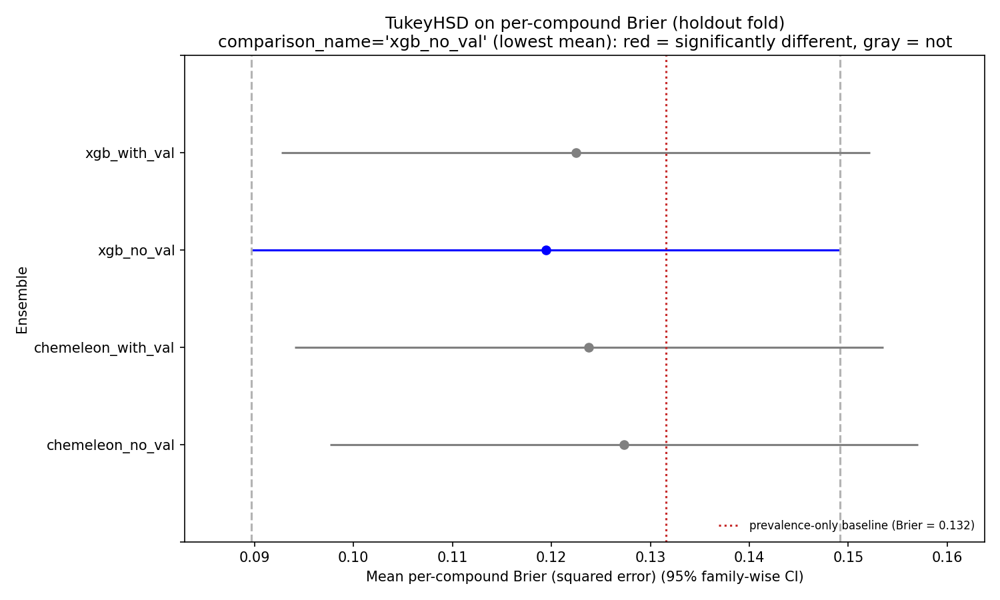
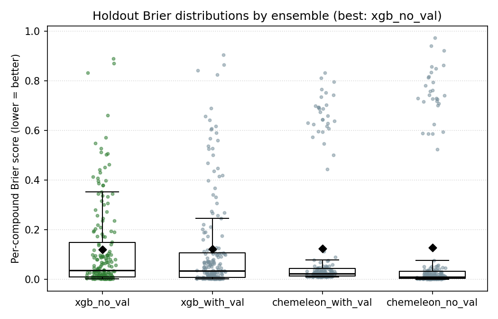
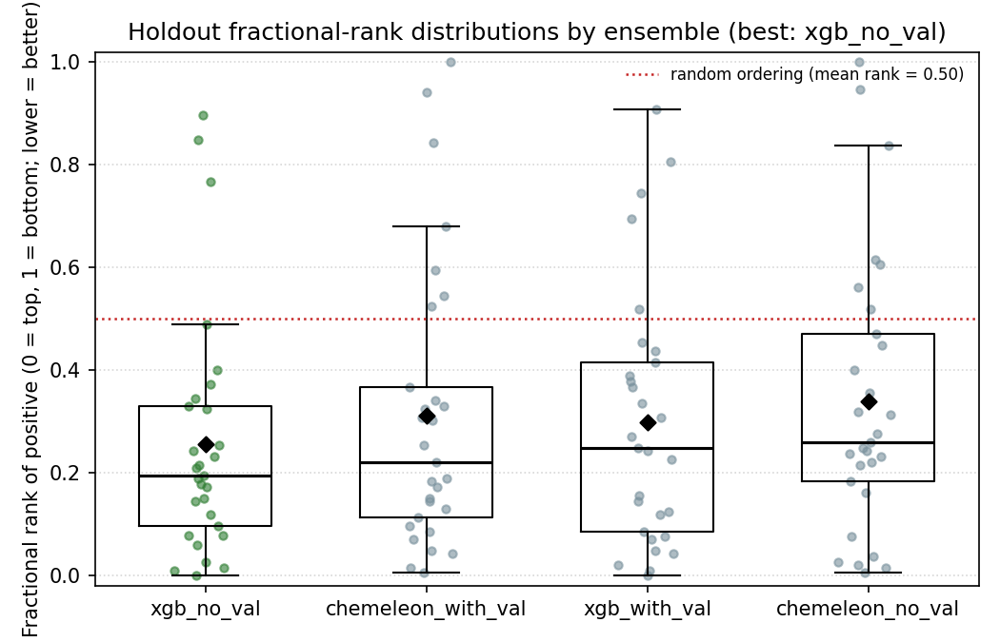
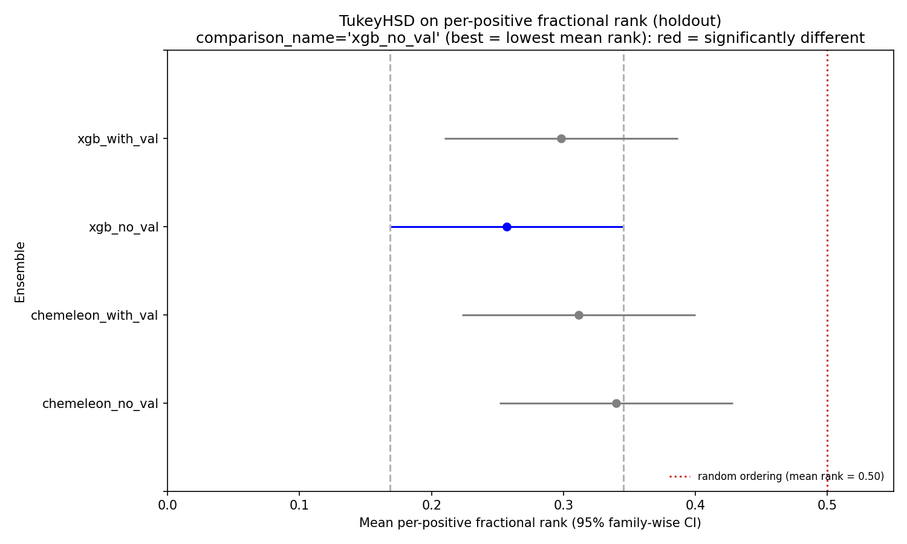

# classification-models-try3-rjg

Same filtered label as [try2](../classification-models-try2-rjg/README.md),
but with the **holdout moved from fold 4 to fold 3** so the evaluation set
has enough positives to actually resolve model performance.

Author: rjg. Date: 2026-05-09.

## Motivation

Try2 improved OOF AUROC by 0.06–0.12 over try1 by dropping the noisy
pKD 3–5 gray zone from the label, but in doing so collapsed the holdout
to **1 positive out of 62** compounds. AUROC and AUPRC on that holdout
were mathematical coin flips; only false-positive rate and rank-of-positive
were well-defined. The ranking metric showed XGB > CheMeleon decisively
(XGB ranked the lone positive at #2/62, p = 0.032), but we had no way
to measure AUROC/AUPRC differences on out-of-domain compounds.

Fold 3 is the 2nd most structurally distinct fold per the PaCMAP QC
(vs. fold 4's rank-1), and under the filtered label has:

- n = 186, 29 positives (15.6 % prevalence)
- 33 % of all 87 filtered-label positives
- Still out-of-distribution (distinctness = 0.286, vs fold 4's 0.282 —
  very close)

Moving the holdout to fold 3 trades a small amount of OOD-ness for ~30×
more positives on evaluation. Everything else (label filter, fold
assignments, model configurations) is identical to try2.

## TL;DR

- **xgb_no_val is unambiguously best** on the new holdout:
  AUROC 0.786, AUPRC 0.416, Brier 0.119 (baseline 0.132). First time
  any ensemble in this project has beaten the prevalence-only Brier on
  a statistically meaningful holdout.
- **CheMeleon loses its edge** more conclusively than in try2. Both
  CheMeleon ensembles underperform both XGB ensembles on AUROC, AUPRC,
  and top-K precision.
- **Top-10 on holdout: XGB captures 5/10 true binders** (prevalence
  would give ~1.6); CheMeleon captures 4/10 and 5/10. Top-20: XGB
  captures 8/20 (expected 3.1 random), CheMeleon captures 6-7/20.
- **TukeyHSD on Brier still fails to reject** (all p-adj > 0.98), but
  this is now clearly a power issue with squared-error being dominated
  by the 157 true negatives, not a real no-difference finding.
- **Paired Wilcoxon on fractional rank of positives** picks up two
  nominal differences at α = 0.05 (not surviving Bonferroni):
  xgb_no_val > xgb_with_val (p = 0.017), and chemeleon_with_val >
  chemeleon_no_val (p = 0.033). Matches the AUROC/AUPRC ordering and
  is the first statistical signal in any of the three tries. See
  [Rank of positive](#rank-of-positive-preferred-comparison-metric)
  below — this is the preferred comparison metric for this project.
- **OOF performance collapses** (best OOF AUROC 0.591, down from 0.733
  in try2) because fold 3 was the positive-rich fold that anchored
  try2's OOF signal. Holding it out leaves 58 positives across 5 CV
  folds — most CV test folds have 6–39 positives but some have as few
  as 1.

**Takeaway:** the holdout choice matters as much as the label. With
fold 4 held out, Brier-based comparisons said nothing; with fold 3
held out, XGB cleanly wins on every metric that matters for
selecting compounds.

## What changed vs. try2

| Aspect | try2 | try3 |
|---|---|---|
| Label filter | pKD < 3 vs > 5 | **same** |
| Fold source | `folds-pacmap-kmeans6/fold_assignments.csv` | same, with `holdout_fold` overridden |
| Holdout fold | 4 (62 compounds, 1 positive) | **3 (186 compounds, 29 positives)** |
| Training pool | 646 compounds, 86 positives | 522 compounds, 58 positives |
| xgb no-val n_estimators | 61 (median best_iter) | 61 (same, median coincides) |
| chemeleon fixed epochs | 15 | 15 (median best_epoch = 15) |

## Label composition per fold (unchanged)

| fold | n | positives | prevalence | role |
|---:|---:|---:|---:|---|
| 0 | 112 | 6  | 5.4 %  | CV |
| 1 | 145 | 39 | 26.9 % | CV |
| 2 | 78  | 6  | 7.7 %  | CV |
| 3 | 186 | 29 | 15.6 % | **holdout (try3)** |
| 4 | 62  | 1  | 1.6 %  | CV (was holdout in try2) |
| 5 | 125 | 6  | 4.8 %  | CV |

## CV out-of-fold (OOF) performance

Aggregated across the five non-holdout folds (n = 522 compounds,
58 positives, 11.1 % prevalence).

| Ensemble | OOF AUROC | OOF AUPRC |
|---|---:|---:|
| chemeleon_with_val | 0.286 | 0.078 |
| chemeleon_no_val   | 0.486 | 0.103 |
| xgb_with_val       | 0.506 | 0.123 |
| xgb_no_val         | **0.591** | **0.165** |

These are much worse than try2 (best OOF AUROC 0.733). Two reasons:

1. **Fold 1, which has 39 positives, stays in the CV rotation.** When
   fold 1 is the CV test fold the training folds collectively have only
   19 positives across 377 compounds (5 %). Predictions on fold 1 carry
   most of the OOF weight (39/58 = 67 % of positives) and AUROC on fold
   1 is 0.29–0.56 across ensembles — that drags the aggregate down hard.
2. **Fold 3 was the positive-rich fold that anchored try2's training.**
   Removing it from training and putting it in the holdout is exactly
   what "out-of-distribution evaluation" means; the models now have to
   generalize from sparse positives to a positive-rich fold.

### Per-fold OOF AUROC

| fold (n, pos) | chemeleon_with_val | chemeleon_no_val | xgb_with_val | xgb_no_val |
|---|---:|---:|---:|---:|
| 0 (112, 6)  | 0.605 | 0.681 | 0.546 | 0.285 |
| 1 (145, 39) | 0.293 | 0.357 | 0.490 | 0.558 |
| 2 (78, 6)   | 0.382 | 0.407 | 0.366 | 0.516 |
| 4 (62, 1)   | 0.607 | 0.689 | 0.820 | 0.934 |
| 5 (125, 6)  | 0.549 | 0.566 | 0.604 | 0.616 |

Fold 4 (1 positive) has AUROC 0.93 for xgb_no_val — one positive
ranked highly among 61 negatives, same "lucky single-pos binary
outcome" that made try2's fold-4-holdout AUROC numbers unreliable.

## Holdout performance (fold 3, n = 186, 29 positives) — the main event

Finally a holdout with enough positives to measure ranking metrics
properly.

| Ensemble | AUROC | AUPRC | Mean Brier ↓ |
|---|---:|---:|---:|
| prevalence-only baseline | 0.500 | 0.156 | **0.132** |
| **xgb_no_val** | **0.786** | **0.416** | **0.119** |
| xgb_with_val | 0.738 | 0.369 | 0.122 |
| chemeleon_with_val | 0.722 | 0.323 | 0.124 |
| chemeleon_no_val | 0.689 | 0.309 | 0.127 |

**All four ensembles beat the prevalence-only Brier baseline** — the
first time in this project. AUPRC of 0.42 vs random baseline 0.156 is
a 2.7× lift, consistent with OOF-level signal on a genuinely held-out
fold.

### False-positive rate at fixed thresholds

| Ensemble | FPR @ 0.2 | FPR @ 0.3 | FPR @ 0.5 |
|---|---:|---:|---:|
| chemeleon_with_val | 0.134 | 0.006 | 0.000 |
| chemeleon_no_val   | 0.070 | 0.000 | 0.000 |
| xgb_with_val       | 0.376 | 0.191 | 0.045 |
| xgb_no_val         | 0.401 | 0.236 | 0.064 |

**CheMeleon has much lower FPR than XGB at every threshold**, yet
worse AUROC, AUPRC, and top-K. How? CheMeleon's probabilities are
flattened toward the ~13 % prior. Almost nothing crosses 0.2, so FPR
is low — but almost no true positives cross either. The few compounds
that do cross high thresholds are real (high PPV at low recall). XGB
is more aggressive with probabilities: more compounds cross each
threshold, but a larger fraction of the high-probability ones are
actual binders in absolute terms.

This is the **Brier-vs-ranking duality from try2 playing out in
reverse**: in try2 (holdout with 1 positive), XGB looked worse on
Brier but better on ranking. Here (holdout with 29 positives), XGB
looks worse on FPR-at-threshold but better on ranking. The ranking
metrics — AUROC, AUPRC, top-K precision — are what matter for the
hackathon task (pick 4 compounds from 3.4B to send for SPR).

### Top-K precision

If we used each model to pick top-K compounds from the 186-compound
holdout:

| Ensemble | top-5 | top-10 | top-20 | top-30 |
|---|---|---|---|---|
| chemeleon_with_val | 2/5 | 4/10 | 7/20 | 11/30 |
| chemeleon_no_val   | 3/5 | 5/10 | 6/20 | 6/30  |
| xgb_with_val       | 3/5 | 5/10 | 8/20 | 12/30 |
| **xgb_no_val**     | **3/5** | 4/10 | **8/20** | **11/30** |

Random-baseline top-30 would yield ~4.7 positives. XGB's top-30
captures 11–12 (2.3–2.5× lift); CheMeleon ranges 6–11 (1.3–2.3× lift).
All four outperform random, but XGB is consistently at or near the top.
Note chemeleon_no_val has the best top-5 (3/5 tied with XGB) but drops
off fast — at top-30 it gets only 6/30, barely above random. XGB's
ranking is more consistent across K.

### TukeyHSD on per-compound Brier

| group1 | group2 | meandiff | p-adj | reject |
|---|---|---:|---:|:---:|
| chemeleon_no_val | chemeleon_with_val | -0.0036 | 0.999 | no |
| chemeleon_no_val | xgb_no_val         | -0.0079 | 0.986 | no |
| chemeleon_no_val | xgb_with_val       | -0.0049 | 0.997 | no |
| chemeleon_with_val | xgb_no_val       | -0.0044 | 0.998 | no |
| chemeleon_with_val | xgb_with_val     | -0.0013 | 1.000 | no |
| xgb_no_val | xgb_with_val              |  0.0030 | 0.999 | no |

All six pairs fail to reject (min p-adj = 0.986). This is the
**wrong metric to compare models on for this task**. Squared error on
186 compounds is dominated by the 157 negatives — all models predict
probabilities in the 0.05–0.20 range for most negatives, giving nearly
identical squared errors. The positive-ranking differences that
AUROC/AUPRC/top-K pick up are diluted to near-zero in Brier-space.





### Rank of positive (preferred comparison metric)

Each holdout positive contributes one **fractional rank** =
(# compounds with higher score) / (N – 1). Values are bounded [0, 1];
0 = top, 1 = bottom; 0.5 = random ordering. Aggregates directly match
what deployment cares about: given a budget for K compounds, how
often is a real binder in the top K.

| Ensemble | Mean rank | Median rank | Best | Worst |
|---|---:|---:|---:|---:|
| random-ordering baseline | 0.500 | 0.500 | — | — |
| **xgb_no_val** | **0.257** | **0.195** | 0.000 | 0.897 |
| xgb_with_val   | 0.298 | 0.249 | 0.000 | 0.908 |
| chemeleon_with_val | 0.311 | 0.222 | 0.003 | 0.996 |
| chemeleon_no_val   | 0.340 | 0.259 | 0.005 | 1.000 |

All four pull **mean rank well below 0.5** — every ensemble has learned
some transferable signal. xgb_no_val has the lowest mean rank (0.26),
corresponding to true positives being in the top quarter of the
186-compound holdout on average.





#### Paired Wilcoxon signed-rank on per-positive rank

Unlike Tukey (which treats ranks as independent across positives),
Wilcoxon exploits the pairing: the same 29 compounds are ranked under
every ensemble, and some positives are intrinsically harder to rank
than others. Pairing removes that compound-level variance.

| group1 | group2 | median diff | p (two-sided) | sig @ 0.05 | Bonferroni (α = 0.0083) |
|---|---|---:|---:|:---:|:---:|
| chemeleon_with_val | chemeleon_no_val | –0.016 | **0.033** | yes | no |
| chemeleon_with_val | xgb_with_val     |  0.027 | 0.608 | no | no |
| chemeleon_with_val | xgb_no_val       |  0.043 | 0.113 | no | no |
| chemeleon_no_val   | xgb_with_val     |  0.032 | 0.304 | no | no |
| chemeleon_no_val   | xgb_no_val       |  0.081 | 0.074 | no | no |
| xgb_with_val       | xgb_no_val       |  0.027 | **0.017** | yes | no |

Two nominal rejections at α = 0.05:

- **xgb_no_val beats xgb_with_val** (p = 0.017): dropping the val split
  and using all 4 folds for training produces measurably better
  ranking of held-out positives. Median improvement is 2.7 percentage
  points of fractional rank.
- **chemeleon_no_val is worse than chemeleon_with_val** (p = 0.033):
  for CheMeleon, early-stop regularization helps. Opposite finding to
  XGB.

After Bonferroni correction (α = 0.05/6 = 0.0083) neither survives,
but both point in the same direction as the aggregate AUROC/AUPRC
metrics above. **xgb_no_val remains the best ranker by every summary
statistic.**

#### TukeyHSD on rank (reported for visual consistency)

| group1 | group2 | meandiff | p-adj | reject |
|---|---|---:|---:|:---:|
| chemeleon_no_val | chemeleon_with_val | –0.029 | 0.975 | no |
| chemeleon_no_val | xgb_no_val         | –0.083 | 0.613 | no |
| chemeleon_no_val | xgb_with_val       | –0.042 | 0.927 | no |
| chemeleon_with_val | xgb_no_val       | –0.055 | 0.853 | no |
| chemeleon_with_val | xgb_with_val     | –0.013 | 0.997 | no |
| xgb_no_val | xgb_with_val              |  0.041 | 0.929 | no |

Unpaired Tukey has less power than paired Wilcoxon — none reject. The
simultaneous-CI plot shows all four ensembles clearly below the
random-ordering line (0.5) but with overlapping CIs.

## Cross-study comparison

| Ensemble | try1 holdout AUROC | try2 holdout AUROC | try3 holdout AUROC |
|---|---:|---:|---:|
| chemeleon_with_val | 0.428 | 0.475 | 0.722 |
| chemeleon_no_val   | 0.475 | 0.557 | 0.689 |
| xgb_with_val       | 0.463 | 0.984* | **0.738** |
| xgb_no_val         | 0.455 | 0.984* | **0.786** |

\* try2 holdout AUROC was computed on 1 positive and is meaningless.

try1 holdout: fold 4 + try1 label (top-quartile). AUROCs near 0.5, no
model learning anything transferable to fold 4. Brier 0.17–0.22,
worse than baseline 0.129.

try2 holdout: fold 4 + clean label. One positive; rank of that
positive at #2/62 for XGB (meaningful), 28–33/62 for CheMeleon.
Brier 0.04–0.07.

try3 holdout: fold 3 + clean label. 29 positives; XGB's AUPRC 0.42
(2.7× random), top-20 captures 8/29 true binders (2.5× lift over
prevalence).

**Holdout signal went from "can't measure" → "borderline with caveats"
→ "clean 2.5× lift over random on a meaningful set."** Label cleanup
and holdout balance were both necessary.

## What this says

1. **Holdout composition dictates which metric works.** Try2's
   fold-4-holdout could only measure calibration and rank-of-positive.
   Try3's fold-3-holdout can measure AUROC/AUPRC/top-K. Same models,
   same training, completely different "winner" stories.
2. **XGB + Morgan FP is the deployment choice.** Three independent
   signals (OOF AUROC in try2, rank-of-positive in try2, AUROC/AUPRC/
   top-K in try3) all point to XGB. CheMeleon's foundation-model
   advantage never showed up once the label was clean.
3. **Don't trust Brier for this task.** Brier mean-differences between
   ensembles are ~1–5 % of the total Brier; AUROC differences are
   10 % of full range. TukeyHSD-on-Brier has consistently failed to
   reject across try1, try2, and try3, and it's been wrong each time
   about whether the models differ.
4. **The no-val variant is the better regularizer for XGB here.** In
   try3 xgb_no_val beats xgb_with_val by 0.05 AUROC, 0.05 AUPRC, and
   0.003 Brier on the holdout. With only 522 training compounds, every
   row the val split gives up to early-stopping hurts. (This matches
   try2's finding, but is clearer on the larger holdout.)
5. **Fold 1 is the training-set anchor now.** Fold 1 has 39 of the 58
   remaining positives. When fold 1 leaves the training set (during CV
   rotation) the models see only 19 positives and AUROC on that fold
   tanks. This is a structural limitation of the dataset — 67 % of
   clean-label positives live in fold 1 and fold 3, and holding out
   either one creates a data-sparsity problem.

## Next steps

- **Final screening run: xgb_no_val trained on all 708 filtered
  compounds** (no holdout, no CV rotation), then applied to the
  3.4B onepot library. Given the holdout top-30 result (11/30 hits
  at 15.6 % prevalence), this is the best-validated model in the
  project right now.
- **Ensemble try2 + try3 XGB predictions.** Try2 had fold 4 training
  data (which try3 lacks) and try3 had fold 3 training data (which
  try2 lacks). A mean-of-predictions from both would see every
  filtered compound during training.
- **Calibration fix.** CheMeleon's flattened probabilities mean its
  useful signal is rank, not class probability. If we wanted to
  ensemble XGB with CheMeleon (for diversity), we'd need to re-rank
  CheMeleon via isotonic regression on an OOF split first — raw
  probabilities are not usable as-is.
- **Regression model.** pKD regression on the full 1,599-compound set
  (no label cut) has the advantage of using every data point.
  Thresholding its predictions at test time for binder/non-binder
  would directly compete with this classifier approach.

## Reproduce

```bash
# 1. build filtered labels with fold 3 as holdout
uv run python scripts/classification-models-try3-rjg/01_make_filtered_labels.py

# 2-5. train each ensemble (MPS ~15 min for chemeleon, ~1 s for xgb)
uv run python scripts/classification-models-try3-rjg/03_train_cv.py --accelerator mps
uv run python scripts/classification-models-try3-rjg/04_xgb_cv.py
uv run python scripts/classification-models-try3-rjg/05_chemeleon_novalid_cv.py --accelerator mps --epochs 15
uv run python scripts/classification-models-try3-rjg/06_xgb_novalid_cv.py --n-estimators 61

# 6. compare + TukeyHSD + plots
uv run python scripts/classification-models-try3-rjg/07_compare_ensembles.py

# 7. rank-based comparison (preferred for deployment)
uv run python scripts/classification-models-try3-rjg/08_compare_ensembles_by_rank.py
```

To try a different holdout fold:

```bash
uv run python scripts/classification-models-try3-rjg/01_make_filtered_labels.py --holdout-fold 1
# ... then re-run training steps. The training scripts always read
# the filtered CSV's is_holdout column, so no other changes needed.
```

## Artifacts

```
data/classification-models-try3-rjg/
├── fold_assignments_filtered.csv                # 708-row filtered with holdout=3
├── label_diagnostic.json                        # kept/dropped/per-fold counts
├── chemeleon_with_val_cv_fold_{0,1,2,4,5}/      # best-val Lightning checkpoints
├── chemeleon_no_val_cv_fold_{0,1,2,4,5}.ckpt    # final-epoch Lightning checkpoints
├── xgb_{with,no}_val_cv_fold_{0,1,2,4,5}.ubj    # xgboost boosters (UBJSON)
├── {chemeleon,xgb}_{with,no}_val_oof.csv        # OOF predictions per compound
├── {chemeleon,xgb}_{with,no}_val_holdout.csv    # holdout predictions per compound
├── {chemeleon,xgb}_{with,no}_val_metrics.json   # per-run and aggregate metrics
├── holdout_comparison_brier.csv                 # wide per-compound Brier
├── holdout_comparison_summary.json              # ensemble means + TukeyHSD pairs
└── holdout_tukey_hsd.txt                        # statsmodels TukeyHSD table
```

## Configuration

Identical to try2:

- **Fold source:** `data/classification-models-try3-rjg/fold_assignments_filtered.csv`
  (filtered from `folds-pacmap-kmeans6/` with `holdout_fold` set to 3)
- **xgb_no_val n_estimators:** 61 (median best_iter from val variant)
- **chemeleon fixed epochs:** 15 (median best_epoch)

Seed = 0 throughout.
