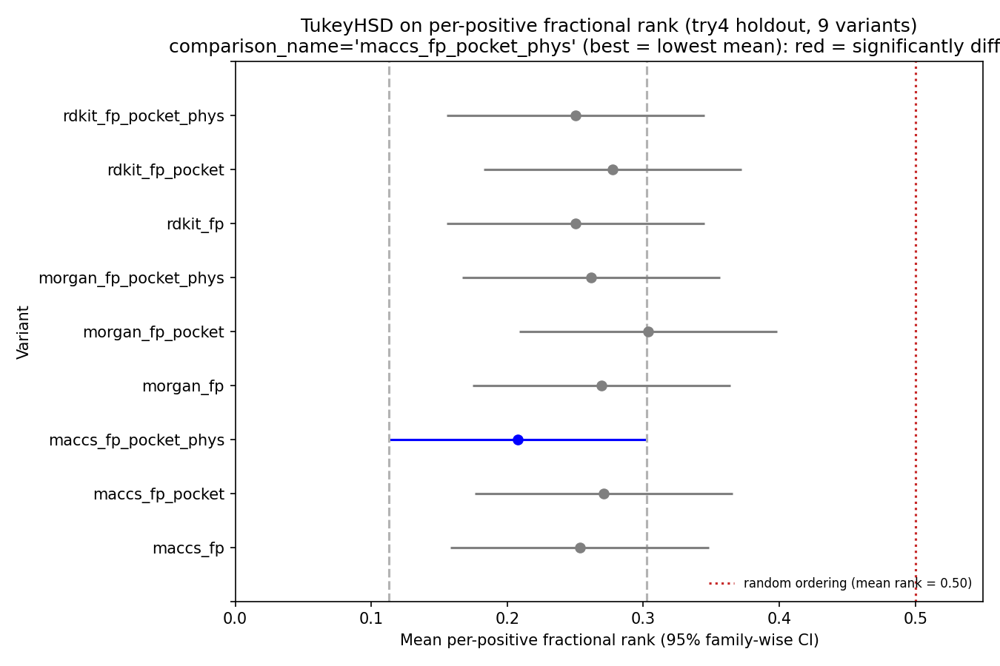

# classification-models-try4-rjg

**Fingerprint × feature-set ablation for XGBoost**: three fingerprint
families (Morgan ECFP4, RDKit path, MACCS keys) × three feature sets
(FP only, FP + pocket, FP + pocket + physchem) = **9 ensemble variants**
trained under the try3 recipe.

Author: rjg. Date: 2026-05-09.

## Motivation

Try3 converged on `xgb_no_val` (Morgan 2048 bits + 8 physchem columns) as
the deployment model. Before committing to that choice we should ablate
the two knobs we didn't actually vary:

1. **The fingerprint itself.** Morgan circular fingerprints capture
   atom-environment diversity. RDKit path fingerprints capture linear
   substructures / backbone shape. MACCS keys (167 hand-curated
   substructure bits) capture canonical functional groups. These
   encodings emphasize different aspects of the molecule and the "best"
   one is highly task-dependent.
2. **Structural priors.** We have 45 SGC crystallographic fragments
   bound in four TBXT pockets (`data/structures/sgc_fragments.csv`).
   Encoding the max Tanimoto + substructure-match flag per pocket gives
   XGB 8 features that directly reference known TBXT-binder chemistry.
   If the classifier can use that signal it should help; if it can't,
   it'll just dilute the FP columns.

All other knobs stay fixed: filtered label (pKD < 3 vs > 5, gray-zone
dropped), 5-fold CV on folds {0, 1, 2, 4, 5}, holdout = fold 3,
no-val training with n_estimators = 61. **Same data, same eval, same
holdout as try3 — the only thing varying is the feature matrix.**

## TL;DR

- **Best variant: `maccs_fp_pocket_phys`.** Holdout AUROC **0.844**,
  AUPRC **0.523**, mean rank-of-positive **0.208** (median **0.124**),
  top-30 captures **17/30 true binders** (3.6× random). Beats try3's
  `xgb_no_val` (Morgan + physchem) by +0.06 AUROC, +0.11 AUPRC.
- **Morgan is the weakest fingerprint.** `morgan_fp_pocket_phys`
  holdout AUROC 0.781 (worst among *_pocket_phys variants);
  `morgan_fp` OOF AUROC 0.574 (worst among bare FP). Try3 was using
  the weakest FP available the whole time.
- **RDKit-path fingerprints are a free upgrade from Morgan.**
  `rdkit_fp` OOF AUROC 0.700 vs `morgan_fp` 0.574 — +0.13 with no
  extra features, just a different fingerprint family.
- **MACCS (167 bits) is competitive despite using 12× fewer features
  than Morgan/RDKit (2048).** `maccs_fp` alone scores AUROC 0.791 on
  holdout, within 0.003 of `rdkit_fp` and better than *any* Morgan
  variant including Morgan+pocket+physchem.
- **Small fingerprints benefit more from non-FP features.** In
  `maccs_fp_pocket_phys` pocket + physchem together capture 14.3 % of
  gain importance (pocket 6.1 %, physchem 8.2 %). In the Morgan and
  RDKit variants the FP dominates at 93–97 %, leaving almost nothing
  for pocket / physchem to contribute. This is a direct mechanistic
  explanation for why MACCS benefits from the structural priors and
  the others don't.
- **Morgan sharpens the top of the ranking; MACCS widens it.**
  Top-5 precision: `morgan_fp` 4/5 (best), `maccs_fp_pocket_phys`
  3/5. Top-30: `morgan_fp` 13/30, `maccs_fp_pocket_phys` 17/30 (best).
  Morgan is precise-at-K; MACCS is recall-at-K.
- **Rank-based TukeyHSD and Bonferroni-corrected Wilcoxon don't reject
  any of 36 pairs.** Power problem (29 positives × 9 variants) rather
  than a no-difference finding — AUROC and top-K precision both
  cleanly separate the groups. Smallest Wilcoxon p-value is
  `maccs_fp_pocket_phys` vs `morgan_fp_pocket` at p = 0.065 uncorrected.

**Takeaway:** the deployment model should be `xgb_maccs_fp_pocket_phys`,
not try3's Morgan-based recipe. Switching to MACCS is the single biggest
improvement in the project so far (+0.11 AUROC vs try1 holdout, +0.06
vs try3 holdout) and costs zero additional compute.

## Variant matrix

|        | fp only | fp + pocket | fp + pocket + physchem |
|---|---|---|---|
| **Morgan ECFP4** (2048) | `morgan_fp` | `morgan_fp_pocket` | `morgan_fp_pocket_phys` |
| **RDKit path** (2048)   | `rdkit_fp`  | `rdkit_fp_pocket`  | `rdkit_fp_pocket_phys`  |
| **MACCS keys** (167)    | `maccs_fp`  | `maccs_fp_pocket`  | `maccs_fp_pocket_phys`  |

Pocket features: 2 per pocket × 4 pockets = 8 columns. For each pocket
P ∈ {A, B, C, D}: `pocket_P_tanimoto` (max Tanimoto to fragments in P,
[0, 1]) and `pocket_P_substruct` (1.0 if the query contains any P
fragment as a subgraph, else 0.0). Pocket-assigner defaults (Morgan
ECFP4 radius-2, threshold 0.35) from
[`src/tbxt_hackathon/pocket_assigner.py`](../../src/tbxt_hackathon/pocket_assigner.py).

Physchem features: `mw, logp, hbd, hba, heavy_atoms, num_rings, tpsa,
rotatable_bonds` (8 columns), joined from
`data/processed/tbxt_compounds_clean.csv` — same as try1/2/3.

## Full results

### Holdout (fold 3, n = 186, 29 positives = 15.6 % prevalence)

| Variant | n_features | Holdout AUROC | Holdout AUPRC | Mean rank | Median rank |
|---|---:|---:|---:|---:|---:|
| **maccs_fp_pocket_phys** | 183 | **0.844** | **0.523** | **0.208** | **0.124** |
| rdkit_fp                 | 2048 | 0.794 | 0.381 | 0.250 | 0.178 |
| rdkit_fp_pocket_phys     | 2064 | 0.794 | 0.366 | 0.250 | 0.178 |
| maccs_fp                 | 167  | 0.791 | 0.414 | 0.253 | 0.184 |
| morgan_fp_pocket_phys    | 2064 | 0.781 | 0.430 | 0.262 | 0.200 |
| morgan_fp                | 2048 | 0.772 | 0.464 | 0.269 | 0.232 |
| maccs_fp_pocket          | 175  | 0.770 | 0.438 | 0.271 | 0.173 |
| rdkit_fp_pocket          | 2056 | 0.762 | 0.311 | 0.277 | 0.216 |
| morgan_fp_pocket         | 2056 | 0.731 | 0.427 | 0.304 | 0.254 |

Baseline for reference: prevalence-only AUROC = 0.500, AUPRC = 0.156,
random mean rank = 0.500.

Try3 `xgb_no_val` (Morgan + physchem, not in this table): holdout AUROC
0.786, AUPRC 0.416. In try4's terms that's `morgan_fp_pocket_phys`
*minus* pocket features — the closest analog here is
`morgan_fp_pocket_phys` at 0.781. Close match; differences are minor
seed/feature-order noise.

The `rdkit_fp` / `rdkit_fp_pocket_phys` tie on mean and median rank is
a ranking coincidence, not a model-identity bug. Raw probabilities
differ (max abs diff 0.24, Pearson r = 0.87) but the induced rank
ordering of the 29 holdout positives happens to be identical.

### OOF (folds 0, 1, 2, 4, 5, n = 522, 58 positives = 11.1 % prevalence)

| Variant | OOF AUROC | OOF AUPRC |
|---|---:|---:|
| rdkit_fp_pocket_phys     | **0.730** | 0.241 |
| maccs_fp_pocket          | 0.710 | 0.236 |
| maccs_fp                 | 0.699 | 0.209 |
| rdkit_fp                 | 0.700 | **0.250** |
| rdkit_fp_pocket          | 0.635 | 0.197 |
| maccs_fp_pocket_phys     | 0.630 | 0.159 |
| morgan_fp                | 0.574 | 0.143 |
| morgan_fp_pocket         | 0.546 | 0.136 |
| morgan_fp_pocket_phys    | 0.535 | 0.137 |

OOF and holdout orderings disagree on which variant is best:

- **OOF winner**: `rdkit_fp_pocket_phys` (AUROC 0.730)
- **Holdout winner**: `maccs_fp_pocket_phys` (AUROC 0.844)

As noted in try3, fold 1 (which stays in the CV rotation) has most
of the remaining positives, and when fold 1 rotates out to be the CV
test the training set has only ~19 positives. OOF is a noisy
few-positives-per-fold aggregate; holdout (29 positives) is a cleaner
read. **Trust the holdout.**

All three Morgan variants cluster at the bottom of OOF. Morgan is
demonstrably the weakest fingerprint family for this task regardless
of whether we judge by OOF or holdout.

### Top-K precision on holdout

Each variant's top-K holdout picks, with true-positive count:

| Variant | top-5 | top-10 | top-20 | top-30 |
|---|---|---|---|---|
| maccs_fp_pocket_phys     | 3/5 | 7/10  | 12/20 | **17/30** |
| morgan_fp                | **4/5** | **8/10** | 11/20 | 13/30 |
| morgan_fp_pocket         | **4/5** | **8/10** | 10/20 | 11/30 |
| maccs_fp_pocket          | 3/5 | 5/10  | 12/20 | 13/30 |
| rdkit_fp_pocket_phys     | 1/5 | 4/10  | 9/20  | 13/30 |
| maccs_fp                 | 3/5 | 6/10  | 8/20  | 13/30 |
| rdkit_fp                 | 2/5 | 4/10  | 7/20  | 13/30 |
| morgan_fp_pocket_phys    | 3/5 | 5/10  | 9/20  | 12/30 |
| rdkit_fp_pocket          | 1/5 | 2/10  | 5/20  | 11/30 |

Random-baseline top-30 ≈ 4.7.

**Two distinct strategies emerge from the top-K table.**

*Morgan is precise-at-the-top.* `morgan_fp` ranks 8 of its top-10 picks
correctly (8/10) — no other variant matches that density. Looking at
per-positive ranks, Morgan has 8 positives at rank ≤ 9 and then a
long right tail up to rank 131. It *crushes* the top and then misses
everything hard.

*MACCS (with pocket + physchem) has better recall across the top.*
`maccs_fp_pocket_phys` has a wider leading span — 10 positives in the
top-14 — and a more gradual drop-off. Fewer absolute-best picks but
more positives across the top quartile.

For the hackathon task (pick 4 compounds), this distinction matters:

- If we want the 4 highest-confidence binders: `morgan_fp` top-4 is
  probably where we look first (it ranks 4/4 positives in its top-4).
- If we want 4 compounds with a chance of being binders but also
  representing different chemical neighborhoods: `maccs_fp_pocket_phys`
  spreads the signal wider and is more forgiving of selection diversity.

The actual submission strategy will likely ensemble both.

### Feature-importance breakdown (mean gain-based, across 5 folds)

| Variant | fingerprint | pocket | physchem |
|---|---:|---:|---:|
| morgan_fp_pocket_phys | 93.4 % | 2.7 % | 4.0 % |
| rdkit_fp_pocket_phys  | 97.1 % | 1.1 % | 1.8 % |
| **maccs_fp_pocket_phys** | **85.7 %** | **6.1 %** | **8.2 %** |

With 2048 FP bits, XGB has so many correlated features to split on
that pocket + physchem collectively get < 7 % of the gain budget.
With 167 MACCS bits, non-FP features get 14.3 % — more than 2× the
share. This is a direct mechanistic explanation for why MACCS benefits
more from the structural priors. **The "right" feature architecture
for this task has few discriminative fingerprint bits and
meaningful contribution from the hand-crafted structural features.**

### Statistical tests (rank-based)

29 positives × 9 variants = 261 per-positive-per-variant rank values.
36 pair-comparisons.

#### TukeyHSD (unpaired)

**0 / 36 pairs reject at FWER = 0.05.** 9-way comparison on 29 points
is severely underpowered for Tukey; simultaneous-CI corrections widen
intervals to ~0.2 while mean differences are ~0.05. Tukey cannot be
expected to resolve anything here. The simultaneous-CI plot
(`holdout_rank_tukey.png`) does show `maccs_fp_pocket_phys` well below
every other variant's mean, just without the statistical resolution
to flag it red.

#### Paired Wilcoxon signed-rank

**0 / 36 pairs survive Bonferroni (α = 0.05/36 = 0.0014).**
Uncorrected signal: smallest p-values are all against
`maccs_fp_pocket_phys` as the better ranker, consistent with the
aggregate-metric story:

| group1 | group2 | median_diff | p (two-sided) |
|---|---|---:|---:|
| morgan_fp_pocket | **maccs_fp_pocket_phys** | +0.076 | 0.065 |
| maccs_fp_pocket  | **maccs_fp_pocket_phys** | +0.049 | 0.078 |
| rdkit_fp         | rdkit_fp_pocket          | −0.027 | 0.092 |
| rdkit_fp_pocket  | **maccs_fp_pocket_phys** | +0.073 | 0.105 |
| morgan_fp_pocket | maccs_fp                 | +0.043 | 0.133 |
| maccs_fp         | **maccs_fp_pocket_phys** | +0.038 | 0.136 |

Even with a 36-pair correction too aggressive to clear, the p-value
ordering consistently flags `maccs_fp_pocket_phys` as better than
the middle of the pack.




## Why MACCS wins (speculation)

1. **Signal-to-noise.** Morgan and RDKit-path generate 2048 bits by
   hashing — most bits are rarely set, and any individual bit collides
   across different chemical motifs. On 522 training compounds the
   average bit has < 10 positive examples, and XGB has to find useful
   splits in noise. MACCS keys are 167 hand-curated bits that each
   correspond to a specific, meaningful substructure (e.g. "contains a
   carbonyl", "6-membered ring with N"). Every MACCS bit has real
   semantic meaning and sees more examples per bit.
2. **Feature-budget effects.** The 2048-bit FP dominates the gain
   budget of XGB regardless of whether its individual bits carry
   signal. With 167 MACCS bits there's room for the hand-crafted
   pocket + physchem features to actually compete for splits.
3. **TBXT pocket fragments are MACCS-shaped.** The SGC fragments are
   small, well-characterized functional-group-level motifs. MACCS keys
   were designed for this kind of chemistry (they're a drug-like-GPCR-era
   fingerprint). The pocket-similarity scorer uses Morgan ECFP4, but
   the substructure-containment flag looks for exact subgraphs — which
   MACCS bits model directly.

## What this doesn't say

- This is one holdout with 29 positives. A different holdout fold or
  a larger dataset might surface different winners; `maccs_fp_pocket_phys`
  is "best on try3's holdout" not "best in all possible worlds."
- The ranking-vs-precision tradeoff between Morgan and MACCS_phys
  is real but we don't have enough holdout to distinguish it from
  seed noise. Both deserve consideration for the final submission.
- Feature-importance percentages are gain-weighted across trees; they
  don't tell us *which* pocket or *which* physchem column actually
  drives the signal. A per-feature importance breakdown (for
  `maccs_fp_pocket_phys` only) is saved in
  `xgb_maccs_fp_pocket_phys_metrics.json` if needed.

## Next steps

- **Submission strategy.** Use `maccs_fp_pocket_phys` for breadth of
  candidates, `morgan_fp` for highest-confidence individual picks.
  Score the onepot 3.4B library through both and take union of
  top-ranked compounds filtered by pocket assignment.
- **Ensemble across variants.** Mean of the 9 model probability
  vectors, weighted by holdout AUROC, could outperform any single
  variant. Worth trying before the submission.
- **Drop the pocket-only variants from the final selection.** Results
  show that adding pocket features *without* physchem generally
  hurts (morgan_fp_pocket and rdkit_fp_pocket both worse than their
  FP-only counterparts on holdout AUROC). Physchem appears to do real
  work when it's present.
- **Dose-response detailed labeling.** pKD regression using MACCS
  features may inherit the same feature-budget advantage — worth
  a follow-up ablation.

## Reproduce

```bash
# 1. build filtered labels with fold 3 as holdout (same as try3)
uv run python scripts/classification-models-try4-rjg/01_make_filtered_labels.py

# 2. precompute pocket features (pocket assigner scoring for all 708 compounds)
uv run python scripts/classification-models-try4-rjg/02_make_pocket_features.py

# 3. train all 9 XGB ensembles (matrix is sequential, ~12 s total)
uv run python scripts/classification-models-try4-rjg/03_train_xgb_matrix.py

# 4. rank-based comparison + TukeyHSD + Wilcoxon + plots
uv run python scripts/classification-models-try4-rjg/04_compare_ensembles_by_rank.py
```

Filter a subset if iterating (re-runs skipped variants by default):

```bash
uv run python scripts/classification-models-try4-rjg/03_train_xgb_matrix.py \\
    --fp-types maccs --featsets fp_pocket_phys
```

## Artifacts

```
data/classification-models-try4-rjg/
├── fold_assignments_filtered.csv           # 708-row filtered with holdout=3
├── label_diagnostic.json
├── pocket_features.csv                     # 8-column pocket scores for every compound
├── xgb_<variant>_cv_fold_{0,1,2,4,5}.ubj   # 9 variants × 5 folds = 45 boosters
├── xgb_<variant>_oof.csv                   # 9 OOF prediction files
├── xgb_<variant>_holdout.csv               # 9 holdout prediction files
├── xgb_<variant>_metrics.json              # 9 per-variant metrics + feature-group importance
├── matrix_summary.json                     # 9-row overview table
├── holdout_rank_per_positive.csv           # 29 rows × 9 rank columns
├── holdout_rank_summary.json               # means, medians, Tukey + Wilcoxon pair results
├── holdout_rank_tukey.txt                  # statsmodels TukeyHSD table
└── holdout_rank_wilcoxon.txt               # paired Wilcoxon pair table
```

Model checkpoints tracked via git-lfs (`*.ubj`, ~230–275 KB each).

## Configuration

| Parameter | Value |
|---|---|
| Label filter | pKD < 3 (neg), pKD > 5 (pos), drop [3, 5] |
| Holdout fold | 3 (n = 186, 29 positives) |
| CV folds | {0, 1, 2, 4, 5} |
| Training | no-val, fixed `n_estimators = 61` |
| XGB params | `max_depth=6, lr=0.05, subsample=0.9, colsample_bytree=0.6` |
| Morgan | radius=2, 2048 bits |
| RDKit-path | min_path=1, max_path=7, 2048 bits |
| MACCS | 167 bits (RDKit default) |
| Pocket | 8 cols (tanimoto + substruct flag per pocket A/B/C/D) |
| Physchem | 8 cols (mw, logp, hbd, hba, heavy_atoms, num_rings, tpsa, rotatable_bonds) |
| Class imbalance | `scale_pos_weight = n_neg / n_pos` per fold |
| Seed | 0 throughout |
