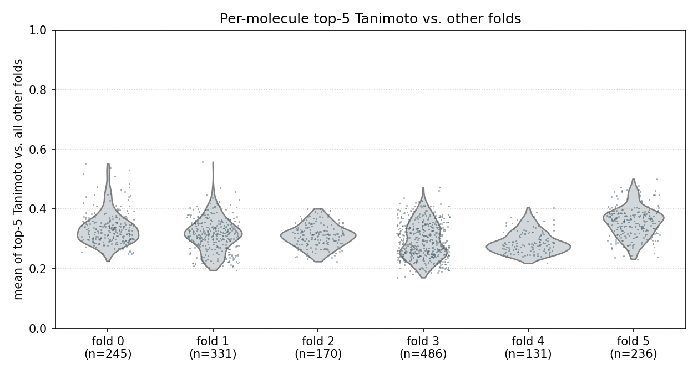
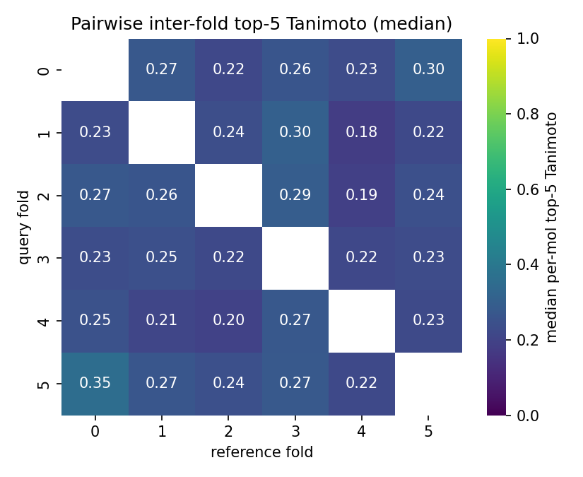

# folds-pacmap-kmeans6

Reusable chemical-space splits of the 1,599 labeled TBXT compounds into 6
structurally distinct folds. Intended as a shared artifact: any modeling
experiment that wants a fair out-of-domain evaluation should consume these
splits rather than roll its own.

## Pipeline

1. Morgan fingerprints (radius = 2, 2048 bits) for every SMILES in
   `data/processed/tbxt_compounds_labeled.csv`.
2. PaCMAP to 2D (`n_neighbors=15`, `random_state=0`).
3. KMeans with `k=6` on the 2D embedding (`random_state=0`, `n_init="auto"`).
4. Fold-quality QC: for each molecule, compute its mean of top-5 Tanimoto
   similarities against every other molecule outside its fold. Fold with the
   lowest median of this per-molecule distribution = most structurally distinct
   ⇒ recommended holdout.

Clustering in the 2D embedding (rather than directly on 2,048-dim bits)
produces clean, geometrically compact folds that are easy to inspect
visually and that tend to correspond to genuinely different scaffold classes.

## Output

| fold | size | median top-5 Tanimoto vs other folds | role |
|---:|---:|---:|---|
| 4 | 131 | **0.282** | **holdout (most distinct)** |
| 3 | 486 | 0.286 | CV |
| 2 | 170 | 0.313 | CV |
| 1 | 331 | 0.316 | CV |
| 0 | 245 | 0.329 | CV |
| 5 | 236 | 0.360 | CV |

Ranking and recommendation are written to `fold_qc_summary.json`. The
`fold_assignments.csv` artifact carries the `fold`, `pacmap_1`, `pacmap_2`,
`holdout_fold`, and `is_holdout` columns alongside the original compound
identifiers, so downstream scripts only need to join on `compound_id` (or
preserve row order).

## Figures

### PaCMAP embedding colored by fold


Fold 4 (purple, bottom center, n=131) sits clearly apart from the rest of
the chemical space. Every fold's centroid is annotated with its fold id;
the holdout fold uses a larger X centroid marker and a black outline on
scatter points.

### Per-molecule top-5 Tanimoto distributions



Each violin shows, for molecules in that fold, the distribution of the mean
of top-5 Tanimoto similarities against the union of all other folds. Lower
mass = that fold is more structurally distinct. Fold 4 has the lowest
median; fold 5 has the highest (its molecules have close neighbors in other
folds, so it's *least* informative as a holdout).

### Pairwise inter-fold top-5 Tanimoto heatmap



Each cell `[query, reference]` is the median per-molecule top-5 Tanimoto
for molecules in the query fold scored against the reference fold. Useful
for spotting fold pairs that are unusually similar (e.g. potential leakage
risk if they were ever combined) or dissimilar.

## Artifacts

```
data/folds-pacmap-kmeans6/
├── fold_assignments.csv     # compound_id, fold, pacmap_*, is_holdout, holdout_fold
└── fold_qc_summary.json     # distinctness ranking, fold sizes, config
```

## Reproduce

```bash
uv run python scripts/01_make_labels.py                    # produces labeled CSV
uv run python scripts/folds-pacmap-kmeans6/02_make_folds.py
```

Runs in ~2 seconds on laptop CPU. Deterministic given the `random_state=0`
seed.

## Configuration

- `N_FOLDS = 6`
- `RANDOM_STATE = 0`
- `PaCMAP(n_neighbors=15, n_components=2)`
- `KMeans(n_clusters=6, n_init="auto")`
- Morgan fingerprints: `radius=2`, `fpSize=2048`

Changing any of these invalidates the holdout-fold choice, so regenerate
downstream models (`classification-models-try*`) if you re-run.
