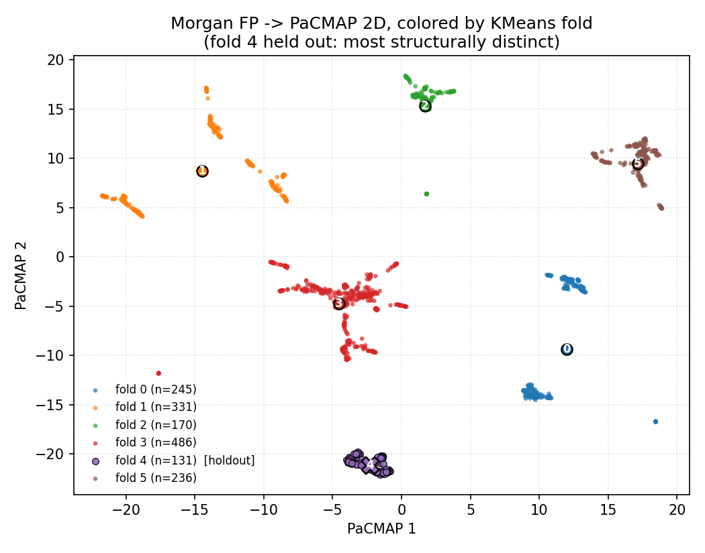
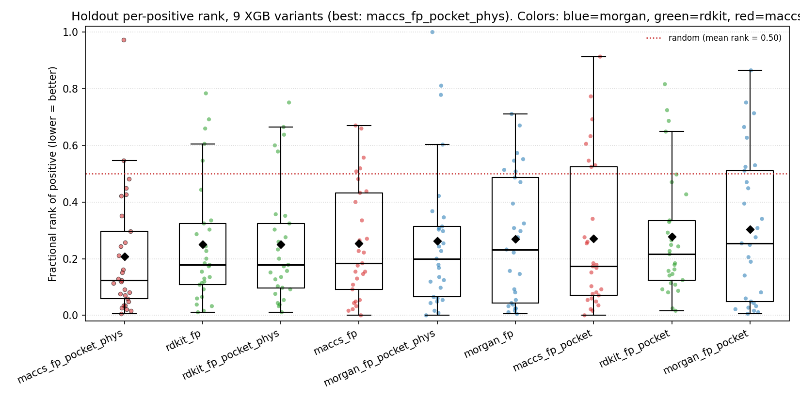
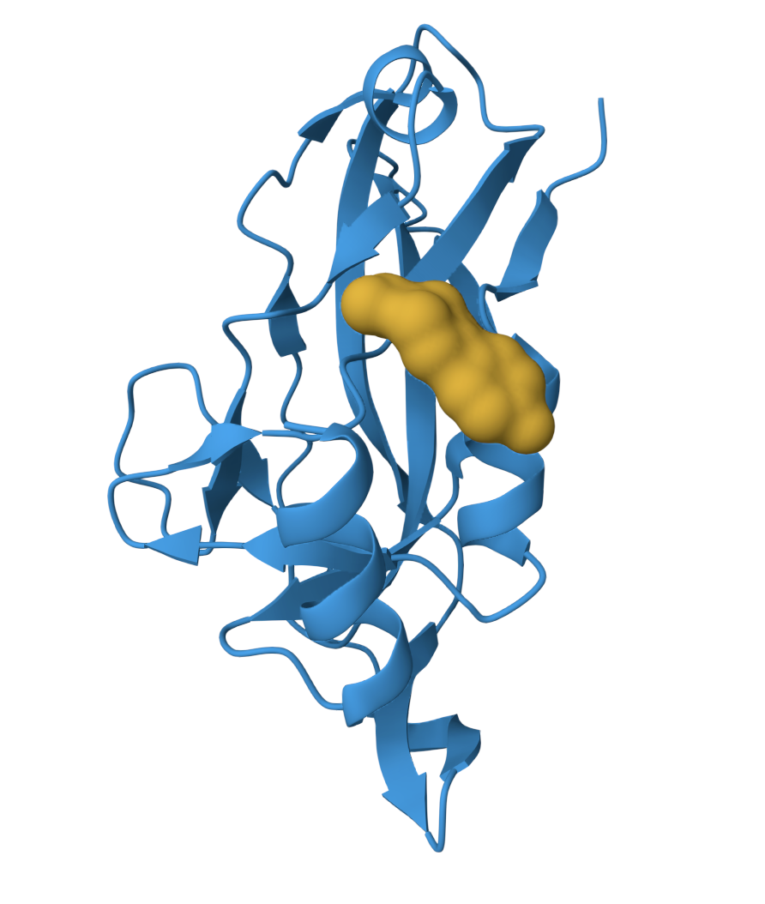
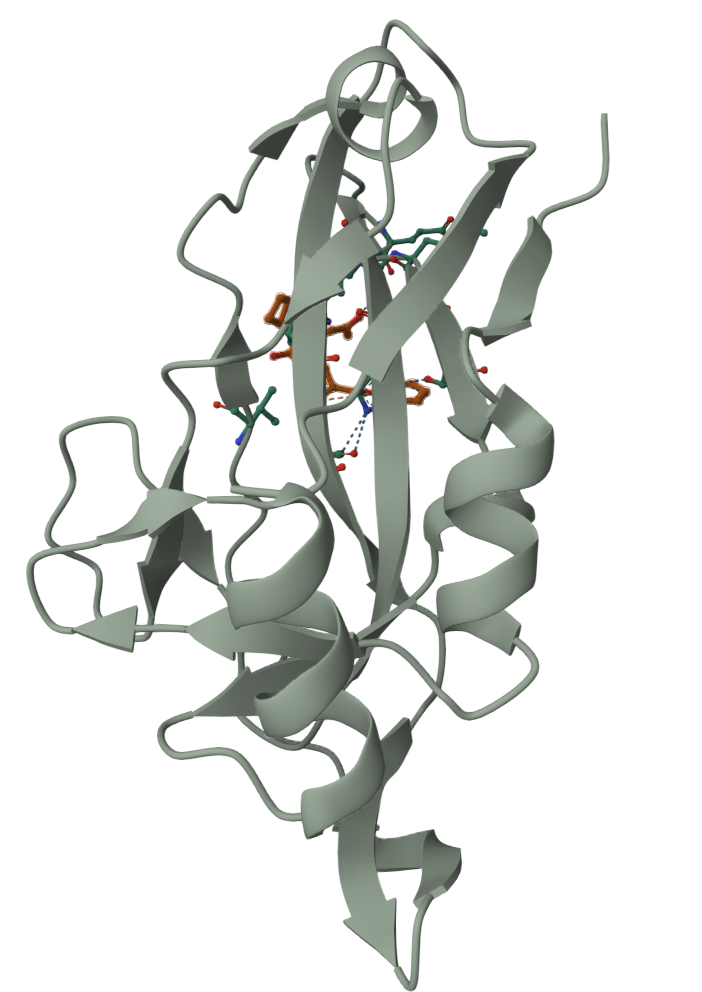

<!-- _class: title -->

# TBXT Hit Identification
## End-to-end virtual screening pipeline

**Nate Harms, Raymond Gasper**
TBXT Hackathon — May 9, 2026 — Boston

Target: human TBXT (Brachyury) DBD, residues 42–219
Source: onepot 3.4B CORE catalog
Submission: 4 ranked SMILES (pockets A and F — see Boltz QC)

---

## Strategy

Standard modern virtual screening: no single signal is strong enough on this target to rank candidates alone, so we combine several and filter at each stage.

<div class="two-col">

<div>

**Signals used:**

- Zenodo SPR — ranker, ~0.65 AUROC ceiling
- Boltz — pose and site localization
- Vina — orthogonal physics
- Fragment substructure / similarity
- Physchem + PAINS + synthesis risk

</div>

<div>

**How they're combined:**

1. Zenodo ML model as a ranker, not a predictor
2. Boltz used primarily for pose, not raw ΔG
3. Vina for cross-check and anchor-residue contact
4. Physchem + PAINS + synthesis risk applied at every stage

</div>
</div>

---

## Target and pocket plan

<div class="two-col">

<div>

**TBXT / Brachyury** — T-box TF, key dependency in chordoma
DNA-binding domain (res 42–219), PDB 6F59
SGC TEP identifies 5 fragment pockets; we target **A, F, G**

| TEP pocket | Anchor residues | Frags | Planned slots | QC survivors |
|---|---|---|---|---|
| **A / A'** | R180, V123, L91, I125, V173, I182 | 26 | 2 | **70** |
| **G** | R54, E48, E50, L51, K76 | 10 | 1 -> 0 | **0** (no pose QC) |
| **F** | Y88, D177, V173, I182 | 4 | 1 -> 2 | **7** |
| ~~D~~ | G112, H100, P115 | 5 | 0 (bad Boltz pose) | — |

</div>

<div class="small">

**Why these pockets** (superposed all PDBs, scored contacts vs Newman signatures):

- **A (2 slots)** — most fragment evidence: 26 hits, the only site Newman progressed to µM SPR (thiazole → 8A7N, 14–20 µM). Boltz reproduces the crystal pose vs 5QS2.
- **G (1 slot)** — 10 hits, largest G177D hotspot. Polar pocket near C-term helix; angle adjacent to DNA interface, distinct from A.
- **F (1 slot, speculative)** — potential novel MoA: Y88 is the P300-interaction residue; pocket mediates KDM6 co-activator recruitment. Engages the G177D variant. Induced and buried, so we rely more on fragment similarity than Boltz scores.
- **D (dropped)** — Boltz pose tilted vs 5QS0 crystal, only 4–5 hits, DNA-competitive angle already covered by G.

<span style="color:#666">Pocket IDs follow the SGC TEP datasheet.</span>

</div>
</div>

---

## Pipeline — end-to-end

```
 onepot CORE                      SGC TEP fragments
        │                                 │
        ▼                                 │
 [1] Downfilter: regex → RDKit            │
     substructure + physchem + PAINS      │
     + risk                               │
        │                                 ▼
        │        [1b] onepot API neighbor queries
        │             + physchem + PAINS + risk
        └─────────────────┬─────────────────┘
                          ▼
              Combined screening library
                          ▼
         [2] XGBoost 12-booster ensemble → p_binder rank
                          ▼
         [3] Pocket-assign → split A / F / G (top 5000 each)
                          ▼
         [4] Diversity cluster (Morgan, Butina-style)
                          ▼
         [5] Boltz pose prediction + pose QC
               (site-localization rejects ~90–95%)
               QC survivors: **A: 70 · F: 7 · G: 0**
                          ▼
         [5b] Exclude Zenodo-similar compounds
               (ECFP4 Tanimoto > 0.85 to any SPR compound)
                          ▼
         [6] AutoDock Vina + anchor-residue check
               R180 (A) · Y88 (F) · E48/R54 (G — no survivors)
                          ▼
                 Final 4 (2·A, 2·F — G slot reallocated)
```

<div class="small">

Pocket G produced zero compounds that passed Boltz site-localization QC. Pocket A yielded 70 survivors; pocket F yielded 7. Slot plan updated: **2× A, 2× F**.

</div>

---

## Modeling the Zenodo SPR data

**Data:** 2,143 SPR records, 14 batches (Oct 2020 – Jan 2023), 1,545 unique compounds after cleaning.

<div class="two-col">

<div>

**The dataset is noisy.**

- Batch date alone explains R² ≈ 0.15 of pKD variance
- ~30% activity cliffs at Tanimoto ≥ 0.7; replicate std ≈ 0.92 pKD (~100× KD)
- Regression: all attempts had negative R² — a data ceiling, not a model ceiling
- Tried the **CheMeleon chemistry foundation model**; competitive but dropped for time

**What we settled on: treat it as a binary ranker.**

- **Excluded the mid-range KD gray zone** (pKD 3–5) — inside replicate noise
- **PaCMAP + KMeans6 folds** for structurally-distinct splits (Butina folds leak scaffolds)
- **12-booster XGBoost ensemble** (2 fingerprints × 6 leave-one-fold-out) on the filtered label

Used as a ranker, not a calibrated probability. Metrics in appendix.

</div>

<div>



<div class="small">

**Training compounds in PaCMAP space**, colored by KMeans6 fold. The ensemble trains 12 boosters leave-one-fold-out so every compound is scored by a booster that did not see it.

</div>
</div>
</div>

---

## Model performance — positive ranking

<div class="two-col">

<div>

**For a ranker, the useful question is where the true positives land.**

Evaluated on the try4 holdout (fold 3, n=186, 29 positives, 15.6% prevalence). For each positive, compute its fractional rank among the 186 holdout compounds after sorting by predicted score. Random = 0.5, perfect = 0.

- `maccs_fp_pocket_phys` (the deployment recipe): median rank 0.124, mean 0.208 — positives land in roughly the top ~12% on average
- Tightest distribution among the 9 variants tested
- Non-fingerprint features contribute modestly (86% MACCS / 6% pocket / 8% physchem importance)

Morgan ranks a handful of positives very high but has a long right tail. MACCS + pocket + physchem is more evenly distributed. Including both in the ensemble covers both behaviors.

</div>

<div>



<div class="small">

**Per-positive fractional rank across 9 fingerprint × feature-set variants**, holdout fold 3 (29 positives). Lower = better; random = 0.5 (grey line).

</div>
</div>
</div>

---

## Boltz site-localization filter — in action

<div class="two-col">

<div>



<div class="small">

**Intended:** compound docked into pocket A (R180 region).

</div>

</div>

<div>



<div class="small">

**Boltz output:** same compound placed in a different pocket entirely.

</div>

</div>
</div>

The site-localization filter is what cut ~90–95% of Boltz survivors. Affinity score alone would have retained compounds that Boltz placed off-site.

**Per-pocket QC outcome (TEP labels):** A = 70 · F = 7 · G = 0. Pocket G was in the plan but no compound survived site localization there.

---

## Final 4

Selected by **Vina rank order** within each pocket (2× A, 2× F; G reallocated after zero site-QC survivors). All four cleared the same pipeline — XGBoost rank → pocket assignment → Boltz site QC → Zenodo novelty → Vina + anchor-residue check.

<div class="tiny">

| Pocket | onepot ID | SMILES |
|:---:|:---|:---|
| A | `SM-AFB2BKPV` | `O=C(c1ccc2c(c1)CCCO2)N1CCC2(CC1)CC(=O)N(c1ccccc1)C2=O` |
| A | `SM-ZBGNCUEF` | `O=C(Cc1ccccc1)Nc1cccc(NC(=O)NCc2ccc3ncsc3c2)c1` |
| F | `SM-QZJTGDW5` | `Clc1cccc(Oc2nnc(Cc3ccccc3)c3ccccc23)c1` |
| F | `SM-68MRL1C4` | `O=C(Nc1cccc(OCc2ccccc2)c1)N1Cc2ccc(O)cc2C(O)C1` |

</div>

<div class="small">

Pocket labels follow the SGC TEP datasheet (pocket F = Newman D).

</div>

---

<!-- _class: appendix-divider -->

# Appendices

---

## Appendix A — Final 4 submission

<div class="tiny">

| Pocket | onepot ID | SMILES | Notes |
|:---:|:---|:---|:---|
| A | `SM-AFB2BKPV` | `O=C(c1ccc2c(c1)CCCO2)N1CCC2(CC1)CC(=O)N(c1ccccc1)C2=O` | Amide donor for R180; extended hydrophobic vector for L91/V123/I125/V173. |
| A | `SM-ZBGNCUEF` | `O=C(Cc1ccccc1)Nc1cccc(NC(=O)NCc2ccc3ncsc3c2)c1` | Multiple donors/acceptors around the urea; benzothiazole fills the hydrophobic cluster. |
| F | `SM-QZJTGDW5` | `Clc1cccc(Oc2nnc(Cc3ccccc3)c3ccccc23)c1` | Compact aromatic fitting the induced Y88/D177 cavity; phthalazine N's near Y88. |
| F | `SM-68MRL1C4` | `O=C(Nc1cccc(OCc2ccccc2)c1)N1Cc2ccc(O)cc2C(O)C1` | Polar head for Y88/D177; benzyloxy tail extends into the buried cavity. |

</div>

<div class="small">

**Common filter pass (all 4):**
- XGBoost deployment ensemble rank (high p_binder)
- Fragment Tanimoto ≥ 0.35 in assigned pocket
- Boltz pose placed at the intended site (site-localization QC)
- ECFP4 Tanimoto ≤ 0.85 to Zenodo SPR set (novelty)
- AutoDock Vina anchor-residue contact (R180 for A; Y88 ± D177 for F)
- Chordoma physchem (LogP ≤ 6, HBD ≤ 6, HBA ≤ 12, MW ≤ 600)

Within-pocket ordering: Vina rank.
Pocket labels follow the SGC TEP datasheet (**F = Newman D**).

</div>

---

## Appendix B — Stage 1 + 1b details (library build)

<div class="two-col">

<div>

**Downfilter 3.4B catalog**
`scripts/downfilter_onepot/`

1. Coarse SMILES regex against canonical + Kekulized fragment SMILES + Bemis–Murcko scaffolds
2. RDKit worker pool: PAINS + bad-SMARTS + `HasSubstructMatch` vs 45 fragments
3. Hard filters: MW/LogP/HBD/HBA, 10–30 HAC, ≤ 5 rings, ≤ 2 fused, ≥ 1 fragment hit
4. Sharded parquet, rollup every 5M rows

**Output: 897,431 compounds**

</div>

<div>

**onepot API nearest-neighbor queries**
`scripts/query_onepot_neighbors.py`

- Per query pocket (A / F / G): 1 API call per SGC fragment
- Pocket A: 1000 neighbors/frag
- Pocket D/F/G: 2000 neighbors/frag
- ECFP4 (r=2, 2048) → route to best pocket
- Physchem + PAINS + synthesis-risk filters applied
- Fragment-substructure filter skipped (already similarity-selected)

**Output: 51,560 unique compounds**

---

**Combined:** `data/screening_library_combined.csv` — **178,332 compounds**

</div>
</div>

---

## Appendix C — Model metrics deep-dive

**Deployment ensemble** — 12 XGB boosters (2 FP × 6 leave-one-fold-out splits on PaCMAP-KMeans6).

<div class="two-col">

<div>

**Overall OOF (N=708, 12.3% prev):**
- AUROC **0.764** · AUPRC **0.337** (random 0.123)
- Top-30 precision on try4 holdout: **17/30** = 57% (random ~16%)
- Mean fractional rank of positives: **0.208** (median 0.124)

**Label choice: pKD > 5, filter 3–5 gray zone.**
Try1 (no filter, top-quartile): holdout AUROC 0.48 (~random).
Try2 (filter gray zone): +0.06 to +0.12 OOF AUROC across variants.
Try4 (ablated FP × features): maccs+pocket+physchem was the best variant, and the only one where non-FP features meaningfully contribute (86% MACCS, 6% pocket, 8% physchem importance).

</div>

<div>

**Why PaCMAP folds:** Butina folds gave an inflated 97% AUROC / 89% precision from scaffold leakage. PaCMAP folds break scaffold-level correlation and give a more honest generalization estimate.

**Feature pipeline (183-dim):**
| Slice | Source |
|---|---|
| 167 cols | MACCS keys |
| 8 cols | Pocket scores (Tanimoto + substruct, 4 pockets) |
| 8 cols | Physchem (MW, LogP, HBD, HBA, HAC, rings, TPSA, rotB) |

Ensemble probabilities used as **rank score only**, not calibrated P(binder).

</div>
</div>

---

## Appendix C2 — Per-fold metrics

<div class="tiny">

**Morgan XGB booster family (per-fold OOF):**

| Held-out fold | N train | N test | Pos train | Pos test | OOF AUROC | OOF AUPRC |
|---|---:|---:|---:|---:|---:|---:|
| 0 | 596 | 112 | 81 | 6 | 0.461 | 0.101 |
| 1 | 563 | 145 | 48 | 39 | 0.648 | 0.389 |
| 2 | 630 | 78 | 81 | 6 | 0.551 | 0.100 |
| 3 | 522 | 186 | 58 | 29 | **0.800** | **0.410** |
| 4 | 646 | 62 | 86 | 1 | 0.918* | 0.167 |
| 5 | 583 | 125 | 81 | 6 | 0.637 | 0.282 |
| **Overall** | — | 708 | — | 87 | **0.736** | **0.312** |

<span class="small">*Fold 4 AUROC computed on 1 positive — uninterpretable in isolation. Fold 3 (29 positives) is the best-powered single-fold estimate.</span>

</div>

**Per-fold variance is large** because positives are unevenly distributed across folds. Fold 0 (6 positives, AUROC 0.46) is a structurally distinct cluster the others don't sample well; the ensemble mean compensates. This is the cost of structure-aware splits on a small, batch-confounded dataset.

---

## Appendix C3 — Pocket assignment details

---

## Appendix D — Stage 4 + 5 (cluster + Boltz)

<div class="two-col">

<div>

**Top 5000 per pocket → diversity cluster**

- Rank by `p_binder_ensemble_mean`
- Butina-style clustering on Morgan FP
- Redundant scaffolds removed *before* the expensive oracle runs

Model scoring is fast on 178k compounds. Boltz is the bottleneck, so we avoid spending it on scaffold twins.

</div>

<div>

**Boltz pose prediction** (Boltz Lab cloud)

Ran Boltz on the clustered top-5000-per-pocket. Pose QC is strict — the site-localization filter alone rejects **~90–95%** of Boltz outputs.

Post-QC survivors docked with Vina:
- **Pocket A: 10**
- **Pocket F: 7**
- **Pocket G: 0** (no compound placed at the intended site passed QC)

Pocket D not run (pose tilted vs crystal).

**Site-localization filter:** reject any compound whose Boltz pose places the ligand outside the intended pocket, allowing for induced-fit displacement. This is the dominant filter; it catches off-site placements that affinity score alone would not flag.

</div>
</div>

**Per-site cautions carried into ranking:**
- Rank *within* a pocket, not across — different pockets give different score distributions
- Pocket F scores inflated by burial + induced-fit; use pose, not absolute ΔG
- Pocket A rewards hydrophobic burial; watch logP

**Post-Boltz novelty filter:** drop any survivor with ECFP4 Tanimoto > 0.85 to any compound in the Zenodo SPR set. Keeps the submission distinct from prior-screened chemistry and avoids spending Vina time on near-duplicates.

---

## Appendix E — Stage 6 + 7 (Vina + final selection)

<div class="two-col">

<div>

**AutoDock Vina** · `docs/docking.md`

- Per-pocket receptor PDBs, box centered on reference fragment, 10 Å padding
- Multi-conformer, interaction analysis (H-bonds, π-stacking, hydrophobic, salt bridges)

**Anchor-residue hard filter:**

| Pocket | Required contact |
|---|---|
| A | H-bond to **R180** |
| F | Contact to **Y88** (±D177) |
| ~~G~~ | **no QC survivors** — skipped |

Fail the anchor check → drop regardless of Vina score.

</div>

<div>

**Final 4 — each candidate must clear:**

- ✅ XGBoost `p_binder_mean` ranks high
- ✅ Fragment Tanimoto ≥ 0.35 in assigned pocket
- ✅ Boltz pose matches the Newman co-crystal
- ✅ Vina score within 1 kcal/mol of per-pocket best
- ✅ Anchor contact present
- ✅ Chordoma physchem satisfied
- ✅ 4 distinct Bemis–Murcko scaffolds
- ✅ Max Tanimoto to Naar set < 0.6

**Slot allocation (actual):** 2× A · 2× F · 0× G
Planned 2·A + 1·G + 1·F; the G slot was reallocated to F after no G compounds passed Boltz site QC.

</div>
</div>

---

## Appendix F — Caveats and references

<div class="two-col">

<div>

**Acknowledged limits**

- SPR data has a ~0.65 AUROC ceiling for absolute prediction (batch effects, activity cliffs) — classifier used as a ranker
- Pocket F scores inflated by induced-fit; we rely on pose, not absolute ΔG
- O0P dual-binder means single-pocket routing is incomplete; multi-assignment fix documented
- CheMeleon foundation model tried and dropped for time
- Goal is fragment-informed, pose-sensible binders with multiple lines of agreement — not a potency breakthrough

</div>

<div>

**Key numbers**

| Stage | Output |
|---|---|
| onepot CORE | 3.4B |
| Downfilter survivors | 897,431 |
| API neighbors (unique) | 51,560 |
| **Combined library** | **?** |
| Top per pocket (pre-cluster) | 5000 |
| Boltz survivors (site-QC rejects ~90–95%) | A: 10 · F: 7 · G: 0 |
| After Vina + anchor | final per-pocket shortlist |
| **Submission** | **4** |

<div class="small">

*Combined library count needs verification — downfilter output + API-neighbor unique compounds don't sum cleanly to the CSV row count.*

</div>

</div>
</div>

<div class="small">

**References:** Newman et al. *Nat Commun* 2025 · SGC TBXT TEP · PDB 6F59 · onepot CORE
**In-repo:** `docs/HACKATHON_PLAN.md` · `docs/deployment-model.md` · `docs/docking.md` · `docs/brachyury-site-summary.md` · `docs/pocket-mapper-soundness.md` · `docs/sar-diagnostics-rjg/README.md`

</div>
