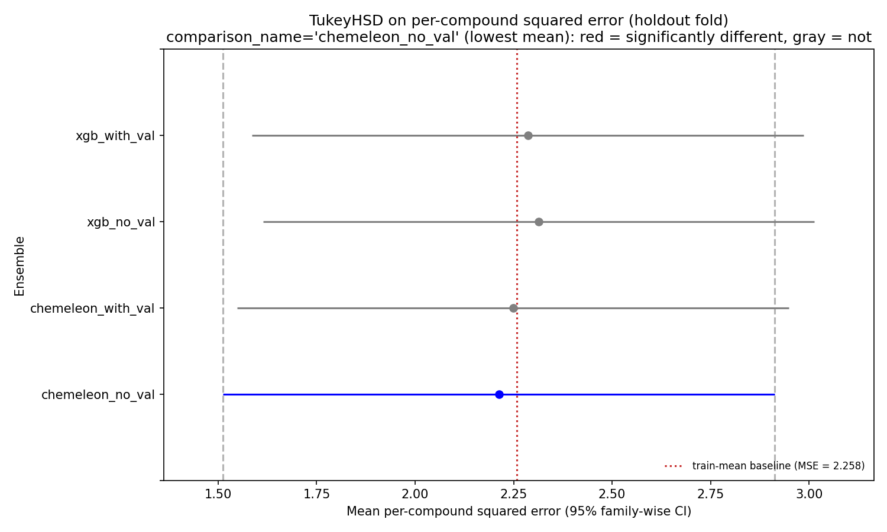
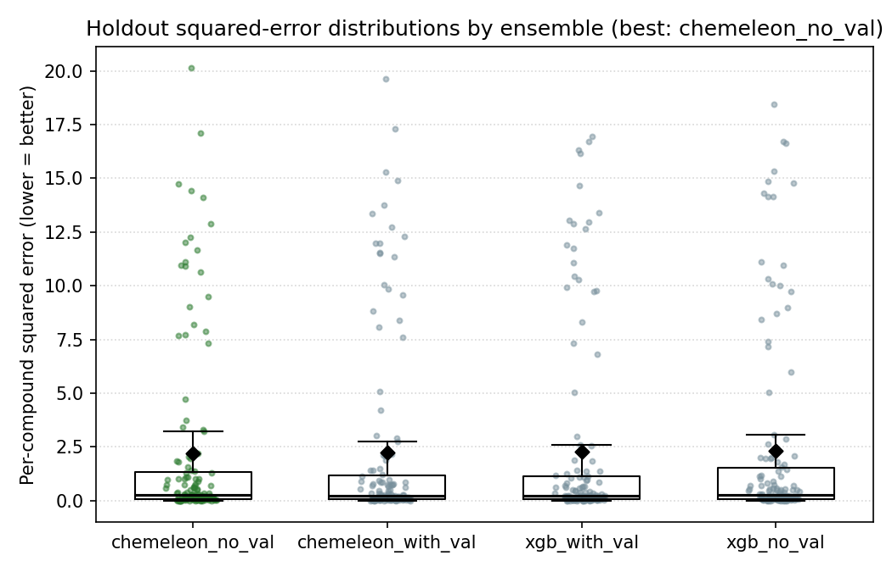
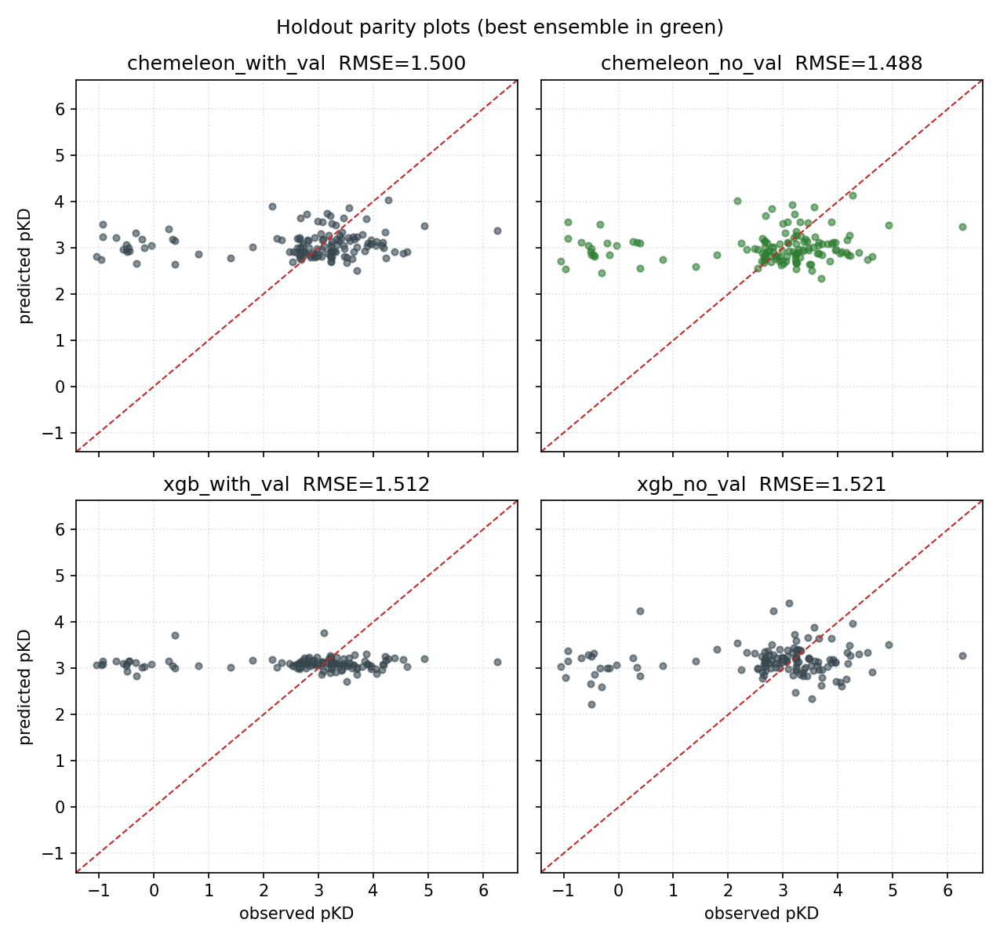

# regression-models-try1-rjg

First pass at **continuous pKD regression** for TBXT. Four model variants
trained on the same 6 chemical-space folds
(see [folds-pacmap-kmeans6](../folds-pacmap-kmeans6/README.md)),
compared on a structurally distinct holdout fold with TukeyHSD.

Author: rjg. Date: 2026-05-08.

## TL;DR

- Best ensemble by holdout mean squared error is **chemeleon_no_val**
  (4-fold training, 15 fixed epochs, no early stopping).
  Holdout RMSE 1.488, R² −0.049, Spearman ρ +0.114.
- **None of the four ensembles is statistically distinguishable** on the
  held-out fold (TukeyHSD, all p-adj > 0.99). The MSE spread across
  ensembles is 0.10; Tukey's 95 % family-wise CIs are ±1.4 wide. At
  n = 131, this sample size has essentially no power to separate models.
- **Only the two chemeleon variants beat the train-mean baseline**
  (baseline MSE 2.258; chemeleon_no_val 2.213, chemeleon_with_val 2.249).
  Both XGB variants (MSE 2.287, 2.314) are *worse* than predicting the
  training-pool mean pKD.
- **OOF R² is near zero or negative** for every ensemble. The models are
  learning *some* rank order (chemeleon_no_val OOF ρ = +0.241) but not
  enough to reduce squared error versus a constant predictor.

## Task

Regression target: `pKD_global_mean` (continuous, in pKD units; higher =
more potent). 1,599 labeled compounds, train-pool mean 3.078 (std 1.60).

Hold out fold 4 (131 compounds) as an out-of-domain evaluation set; this
is the same fold used by
[classification-models-try1-rjg](../classification-models-try1-rjg/README.md).
Train 5-model ensembles on the remaining five folds (1,468 compounds).

## Ensembles compared

| Name | Model | Fold role per CV run | Regularization signal |
|---|---|---|---|
| `chemeleon_with_val` | CheMeleon encoder (8.7 M params) + 2-hidden-layer RegressionFFN (590 K params) | 3 train / 1 val / 1 test, rotate | Early stop on val MSE (patience 10, max 60 epochs) |
| `chemeleon_no_val` | same architecture | 4 train / 1 test, rotate | Fixed 15 epochs (median best-epoch from val variant = 13) |
| `xgb_with_val` | XGBRegressor on Morgan FP (2048) ⊕ physchem (8) | 3 train / 1 val / 1 test, rotate | `early_stopping_rounds=30` on val RMSE |
| `xgb_no_val` | same features | 4 train / 1 test, rotate | Fixed `n_estimators=100` |

Both chemeleon variants use the same MSE loss and NoamLR schedule as the
classification variants, just with `RegressionFFN` swapped for
`BinaryClassificationFFN` and val metric logging on RMSE/MAE/R² instead
of AUROC/AUPRC.

XGBoost objective is `reg:squarederror`, eval metric RMSE.

## CV out-of-fold (OOF) performance

Scoring on the 1,468 non-holdout compounds by aggregating each model's
predictions on its own rotated test fold.

| Ensemble | OOF RMSE ↓ | OOF MAE ↓ | OOF R² | OOF Spearman ρ |
|---|---:|---:|---:|---:|
| chemeleon_with_val | 1.665 | 1.146 | −0.037 | **+0.201** |
| chemeleon_no_val   | **1.640** | **1.125** | **−0.005** | **+0.241** |
| xgb_with_val       | 1.677 | 1.119 | −0.051 | +0.085 |
| xgb_no_val         | 1.721 | 1.154 | −0.107 | +0.113 |

Negative R² means the model does *worse than predicting the fold-mean
pKD* on squared error. Spearman ρ is modestly positive for all variants,
so the models are ranking compounds somewhat, but the magnitude of
prediction is off enough to lose on MSE.

## Holdout performance (fold 4, n=131)

| Ensemble | Mean SqErr (MSE) ↓ | RMSE ↓ | MAE ↓ | R² | Spearman ρ |
|---|---:|---:|---:|---:|---:|
| train-mean baseline        | 2.258 | 1.503 | 0.957 |  0.000 | n/a   |
| **chemeleon_no_val (best)**| **2.213** | **1.488** | 0.985 | **−0.049** | +0.114 |
| chemeleon_with_val         | 2.249 | 1.500 | 0.973 | −0.066 | **+0.129** |
| xgb_with_val               | 2.287 | 1.512 | 0.973 | −0.084 | −0.000 |
| xgb_no_val                 | 2.314 | 1.521 | 1.007 | −0.097 | +0.054 |

Only the two chemeleon variants beat the train-mean baseline on MSE.
The gap (chemeleon_no_val − baseline = −0.045 MSE, i.e. RMSE improvement
from 1.503 to 1.488) is tiny compared to Tukey's ±1.4 CI.

### TukeyHSD on per-compound squared error

Each holdout compound contributes one squared error per ensemble.
TukeyHSD at FWER = 0.05 on the resulting (131 × 4 = 524) values tests
whether mean-squared-error differences across ensembles are significant.

| group1 | group2 | meandiff | p-adj | 95 % CI | reject |
|---|---|---:|---:|---:|:---:|
| chemeleon_no_val | chemeleon_with_val | 0.036 | 1.000 | [−1.364, 1.436] | no |
| chemeleon_no_val | xgb_no_val         | 0.101 | 0.998 | [−1.299, 1.501] | no |
| chemeleon_no_val | xgb_with_val       | 0.074 | 0.999 | [−1.326, 1.474] | no |
| chemeleon_with_val | xgb_no_val       | 0.065 | 0.999 | [−1.335, 1.465] | no |
| chemeleon_with_val | xgb_with_val     | 0.038 | 1.000 | [−1.362, 1.438] | no |
| xgb_no_val | xgb_with_val             | −0.027 | 1.000 | [−1.427, 1.373] | no |

All six pairs fail to reject. p-adj values are essentially 1.0 across
the board — squared error has a long right tail so Tukey's SD estimate
blows up, and the CIs become much wider than the actual effect sizes.
A rank-based test (Kruskal–Wallis + Dunn) or bootstrap on RMSE would
give tighter resolution; noted for follow-up.



Statsmodels' built-in `plot_simultaneous(comparison_name="chemeleon_no_val")`:
the comparison group is blue, groups significantly different from it
would be red (none here). Red dotted line is the train-mean baseline MSE.

### Per-compound squared-error distributions



Distributions overlap almost completely. Black diamond = mean, box = IQR,
whiskers = 1.5×IQR, points = per-compound squared errors with jitter.
The best ensemble (green) sits a hair lower on mean but well within the
spread of the others.

### Parity plots (observed vs. predicted pKD)



All four ensembles predict in a narrow band around the training-pool
mean (pKD ~3). The y=x reference line (red) runs well outside the cloud
of predictions for most compounds. This is visually what R² ≈ 0 looks
like: predictions have very little variance compared to the truth.

## What this says

1. **The signal in this dataset is not strong enough to beat a constant
   predictor on squared error**, at least not with these four off-the-shelf
   ensembles and a structurally distinct holdout. Regression is
   substantially harder than classification here: thresholding pKD into a
   binder/non-binder label apparently collapses enough noise that the
   classifiers recover a modest OOF AUROC, but the underlying continuous
   signal is too noisy and too narrowly distributed for MSE regression to
   show the same lift.
2. **Chemeleon's foundation weights give the only wins over baseline.**
   Both chemeleon variants beat the train-mean baseline by a small but
   consistent margin on holdout MSE; both XGB variants lose to it. On OOF
   Spearman ρ, chemeleon (0.20–0.24) clearly outranks XGB (0.09–0.11),
   suggesting the pretrained message-passing encoder is extracting some
   structure the XGB features miss.
3. **The no-val variant helps both model families slightly.**
   chemeleon_no_val > chemeleon_with_val on every OOF and holdout metric;
   xgb_no_val underperforms xgb_with_val on OOF but the gap is small and
   not significant. Dropping the validation split recovers the 20 % of
   training data that was being held out; for chemeleon this pays off.
4. **TukeyHSD is severely underpowered for regression squared errors.**
   The long right tail of squared error inflates SD and makes pairwise
   95 % CIs ±1.4 wide — roughly 30× the actual effect sizes. A log-scaled
   squared error or a Kruskal–Wallis rank test would be more appropriate
   next time.

## Comparison to classification-models-try1-rjg

Same folds, same 1,599 compounds, same holdout. Both experiments find:

- chemeleon_no_val is the best ensemble on the holdout.
- Nothing is statistically distinguishable at n = 131.
- Models look reasonable on within-cluster OOF and then fall apart on the
  distinct holdout fold.

The classification setup lets models beat random rank ordering on OOF
(AUROC 0.61–0.66). Regression barely beats a constant predictor on
squared error even on OOF (R² near zero). If the goal is compound
ranking for hit-list generation, the classification framing looks more
useful with these model families on this dataset size.

## Next steps (low-hanging)

- Bootstrap holdout RMSE/MAE for a tighter comparison with per-seed
  resampling. Tukey on squared-error is too heavy-tailed.
- Evaluate on the larger 1,468-compound OOF set (already computed),
  which has ~11× the sample size.
- Try Huber loss or a quantile head on chemeleon — the pKD tail matters
  more than the middle for hit finding, and MSE weights outliers
  quadratically.
- Standardize pKD before training and invert predictions; compare to
  raw-pKD training to see if the optimizer prefers the normalized target.
- Train a larger ensemble (≥10 seeds per variant) for more replicates.

## Reproduce

Run in order from the repo root. Each step is idempotent and reads from
the artifacts of the previous step.

```bash
# 1. label compounds (is_binder also kept in fold assignments)
uv run python scripts/01_make_labels.py

# 2. build chemical-space folds (see folds-pacmap-kmeans6/)
uv run python scripts/folds-pacmap-kmeans6/02_make_folds.py

# 3-6. train each ensemble (MPS ~30 min for chemeleon, ~1 s for xgb)
uv run python scripts/regression-models-try1-rjg/03_train_cv.py --accelerator mps
uv run python scripts/regression-models-try1-rjg/04_xgb_cv.py
uv run python scripts/regression-models-try1-rjg/05_chemeleon_novalid_cv.py --accelerator mps --epochs 15
uv run python scripts/regression-models-try1-rjg/06_xgb_novalid_cv.py --n-estimators 100

# 7. compare + TukeyHSD + plots
uv run python scripts/regression-models-try1-rjg/07_compare_ensembles.py
```

## Artifacts

```
data/regression-models-try1-rjg/
├── chemeleon_with_val_cv_fold_{0,1,2,3,5}/          # best-val Lightning checkpoints
├── chemeleon_no_val_cv_fold_{0,1,2,3,5}.ckpt        # final-epoch Lightning checkpoints
├── xgb_{with,no}_val_cv_fold_{0,1,2,3,5}.ubj        # xgboost regressor boosters (UBJSON)
├── {chemeleon,xgb}_{with,no}_val_oof.csv            # OOF predictions per compound
├── {chemeleon,xgb}_{with,no}_val_holdout.csv        # holdout predictions per compound + ensemble mean
├── {chemeleon,xgb}_{with,no}_val_metrics.json       # per-run and aggregate metrics, with model paths
├── holdout_comparison_squared_error.csv             # wide per-compound squared error, one col per ensemble
├── holdout_comparison_summary.json                  # ensemble means, TukeyHSD pairs, baseline
└── holdout_tukey_hsd.txt                            # statsmodels TukeyHSD summary table
```

Model checkpoints are tracked via **git-lfs** (`*.ckpt`, `*.ubj`). Make
sure you have `git-lfs` installed and `git lfs install` has been run
locally before cloning or pulling fresh model files. Chemeleon `.ckpt`
files are ~107 MB each; xgboost `.ubj` files are 90–240 KB each.

### Rehydrating saved models

```python
from pathlib import Path
from chemprop.models import MPNN
from tbxt_hackathon.xgb_baseline import load_xgb_regression_model

# chemeleon (same load_from_checkpoint path as classification; the regression
# head is part of the serialized model so MPNN.load_from_checkpoint does the
# right thing automatically)
cm = MPNN.load_from_checkpoint("data/regression-models-try1-rjg/chemeleon_no_val_cv_fold_0.ckpt")

# xgboost: must use load_xgb_regression_model, NOT load_xgb_model, because the
# persisted booster is an XGBRegressor (reg:squarederror objective).
reg = load_xgb_regression_model(Path("data/regression-models-try1-rjg/xgb_with_val_cv_fold_0.ubj"))
```

## Configuration

**chemeleon** (both variants):
- encoder: CheMeleon pretrained `BondMessagePassing` (2048-dim output)
- head: 2 hidden layers × 256 units, ReLU, dropout 0.2, scalar output
- loss: MSE; val metrics: RMSE, MAE, R²
- optimizer: AdamW, NoamLR schedule (init_lr 1e-7, max_lr 1e-3, final_lr 1e-7), batch 32
- val variant: max 60 epochs, patience 10, monitor val loss
- no-val variant: 15 epochs fixed, final checkpoint saved
- accelerator: Apple MPS

**xgboost** (both variants):
- features: Morgan FP (2048, r=2) ⊕ physchem (mw, logp, hbd, hba, heavy_atoms, num_rings, tpsa, rotatable_bonds)
- objective: reg:squarederror, eval metric RMSE
- hist tree method, max_depth 6, lr 0.05, subsample 0.9, colsample_bytree 0.6
- val variant: up to 1,000 trees, `early_stopping_rounds=30` on val RMSE
- no-val variant: 100 trees fixed

Seed = 0 throughout.
