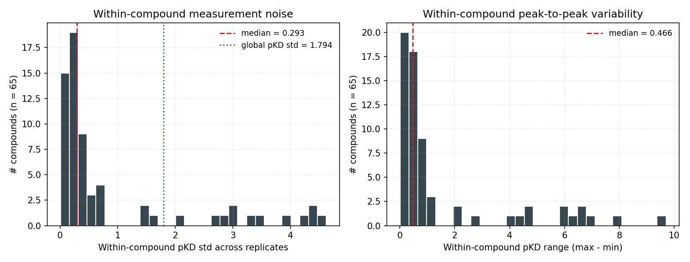
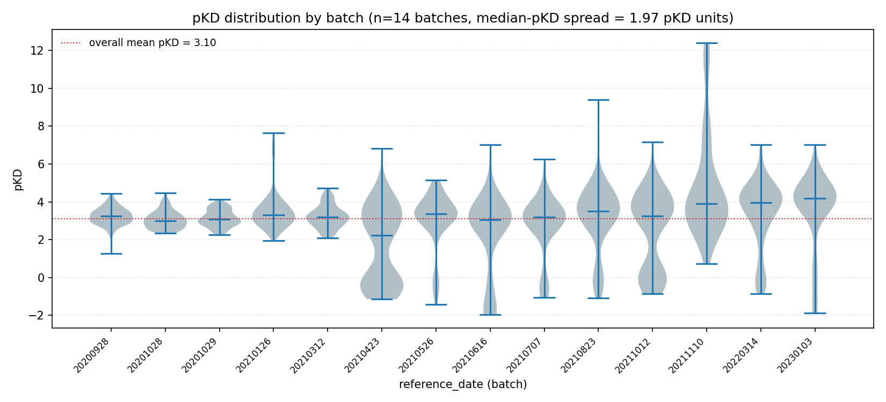
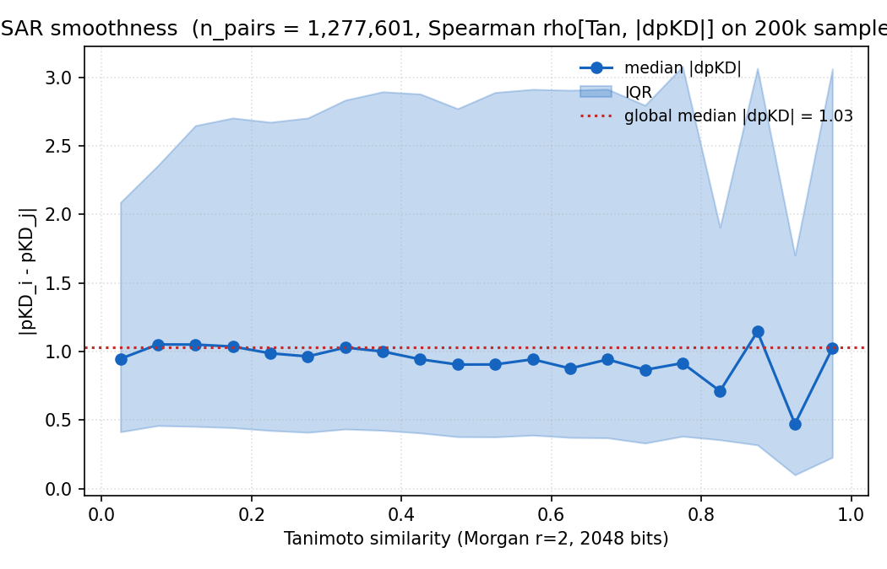
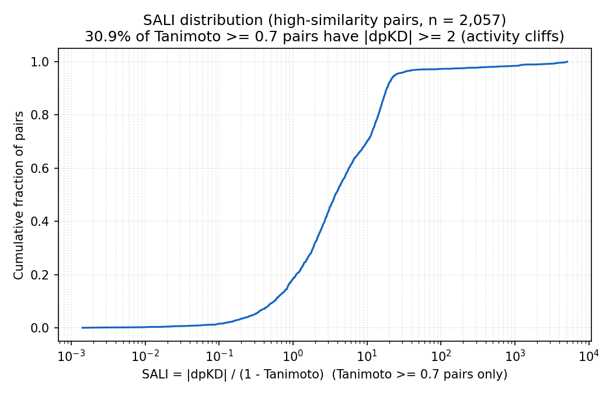
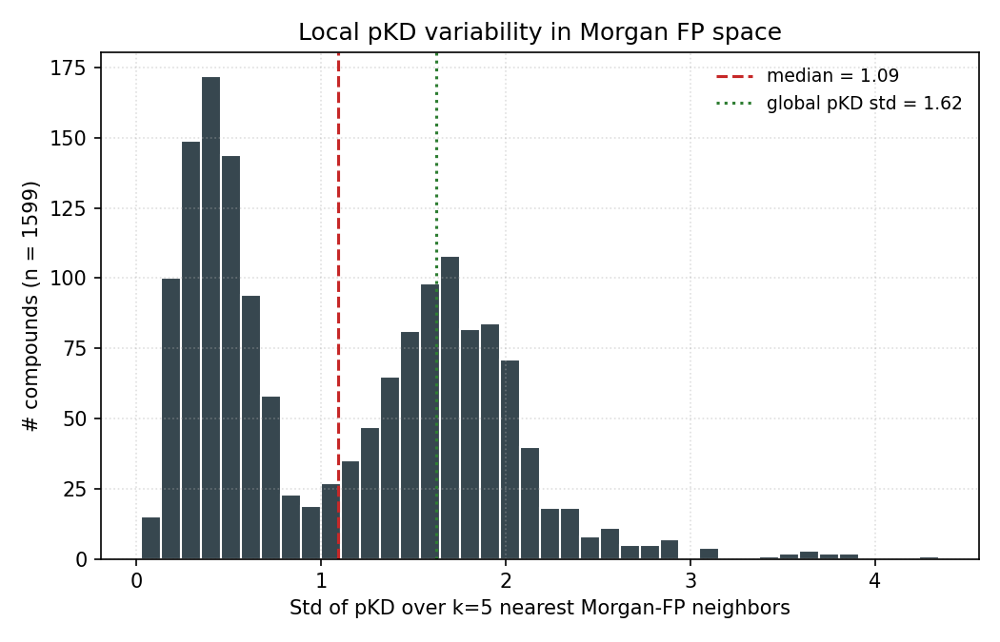
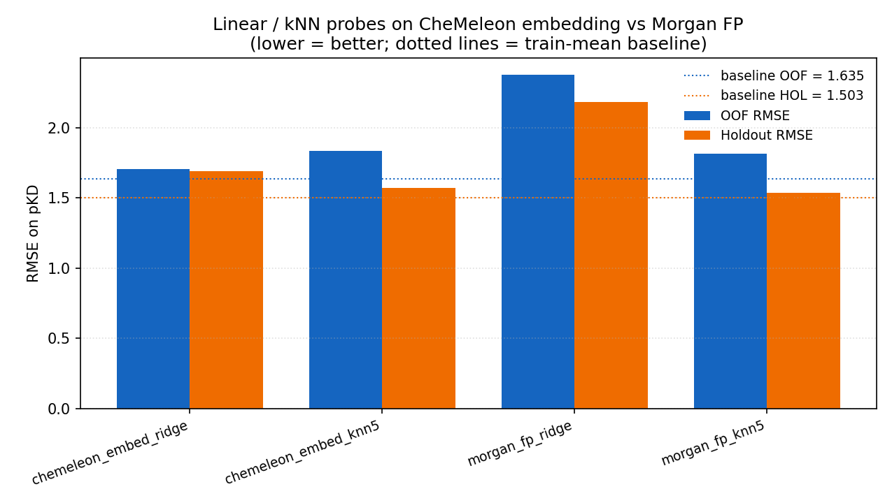
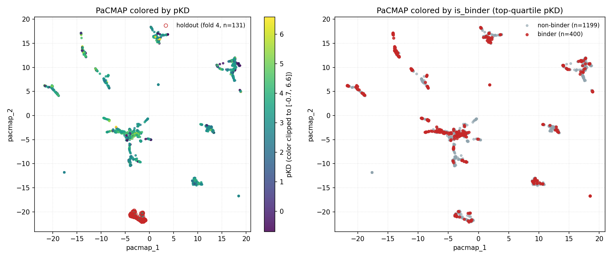
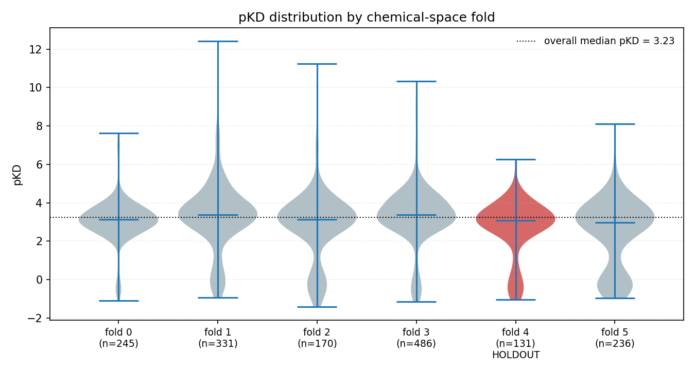
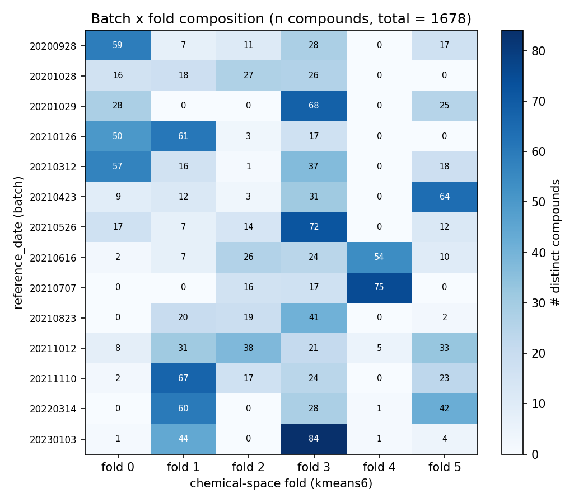
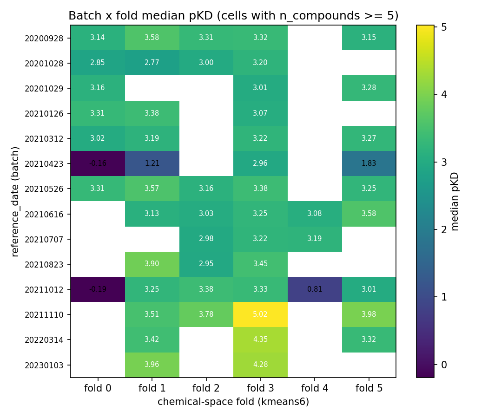

# sar-diagnostics-rjg

Why do CheMeleon + XGBoost, both architectures that routinely learn
useful pKD surfaces on public datasets, fail to beat the train-mean
baseline on our TBXT data? Five diagnostics to attribute the failure
between label noise, SAR decoupling, and covariate shift.

Author: rjg. Date: 2026-05-08.

## TL;DR

**The target is not a clean function of chemistry on this dataset.**
Each diagnostic individually is damning; together they make the
regression failure unsurprising and the classification result (AUROC
0.60+ OOF) look like the upper bound of what any method can recover.

1. **Batch effects dominate.** `reference_date` alone explains
   **R² = 0.155** of pKD variance (no chemistry in the model).
   Median-pKD shifts across the 14 batches by **1.97 pKD units**
   (i.e. ~100-fold KD swing depending on which campaign measured a
   compound). The early batches (2020–early 2021) also show much
   narrower pKD distributions than later ones, suggesting an assay
   protocol change mid-project (likely a switch from null-censoring
   non-binders to reporting finite low-pKD values).
2. **Replicate measurements disagree at the 100-fold level.** For the
   65 compounds measured in >=2 batches (with non-null pKD in each),
   the **mean** within-compound pKD std is **0.92** (23 % of
   compounds have replicate-std >= 1.0; 12 % have std >= 3.0 — a
   1000-fold range on the *same molecule*).
3. **SAR is flat.** On 1.28 M pairs, Spearman rho[Tanimoto, |ΔpKD|] =
   **−0.008**. Median |ΔpKD| in the highest-similarity bin (Tanimoto
   0.95–1.0) is **1.03 pKD**, indistinguishable from the global median
   (1.00 pKD). **30.9 % of pairs with Tanimoto >= 0.7 are activity
   cliffs** (|ΔpKD| >= 2).
4. **CheMeleon's pretrained embedding can't save this.** A Ridge
   probe on the frozen 2048-dim CheMeleon encoding produces OOF
   RMSE 1.707 vs baseline 1.635 — *worse than predicting the mean*.
   Every probe (Ridge/kNN × CheMeleon/Morgan) underperforms the
   constant predictor on RMSE. This is strong evidence that the
   foundation model is fine; the target is broken.
5. **Folds and batches are confounded.** The "OOD holdout" (fold 4)
   is almost exclusively populated by compounds from the 3 most
   recent batches. Cross-validating over folds partly cross-validates
   over batches — the generalization problem our models faced
   included a batch-correction problem they were never told about.

## Diagnostic 1: batch consistency

Source: the full 2,153-record SPR table
(`data/zenodo/tbxt_spr_merged.csv`) preserves every individual
measurement with a `reference_date` batch identifier. Of those, **240
records (11 %) have null pKD** — SPR runs where KD could not be
determined (weak/no binding, noisy signal, etc.). These are
concentrated in the first few batches and are dropped from the analyses
below. Clean n = 1,913 records across 1,680 unique compounds.

### Within-compound replicate variability

For the 65 compounds measured more than once (always across different
batches) with non-null pKD in each measurement, we have the
distribution of replicate std within each compound:

| statistic | value (pKD units) |
|---|---:|
| median within-compound std | 0.293 |
| mean within-compound std   | **0.923** |
| p90 within-compound std    | 3.220 |
| max within-compound std    | 4.620 |
| global pKD std (reference)  | 1.794 |

Median replicate noise (0.29) is moderate. But the mean (0.92) is
pulled up by a long tail: at the p90, replicate std is **larger than
half the global pKD std**, meaning a model predicting a compound's
pKD from chemistry cannot be expected to do better than just echoing
the replicate noise for those compounds. The max (4.62) corresponds
to replicate measurements of the same molecule differing by ~10,000×
in KD.



### Per-batch pKD distributions

14 batches. Median pKD per batch ranges from about 2.6 to 4.5
(spread **1.97 pKD units**). Batch-only one-way ANOVA gives
**R² = 0.155** — batch membership explains ~15 % of pKD variance
without touching chemistry.



Some batches (e.g. 20230103) produce systematically higher pKD than
others (e.g. 20201028). Even more striking is the **change in
distribution shape over time**: the first 5 batches (20200928–20210312)
have narrow pKD distributions clustered around 3, while batches from
20210423 onward have dramatically wider distributions extending down to
pKD ≈ −2. Almost certainly an assay protocol update mid-project: early
batches probably null-censored non-binders (which we see as the 240
dropped records, mostly from early dates), while later batches began
reporting finite low-pKD values for the non-binding tail. The merged
`pKD_global_mean` column we train on is a linear combination of
chemistry, measurement batch, and protocol era — in unknown proportions
per compound.

**Upshot**: ~15 % of the target is pure batch/protocol noise. The
theoretical R² ceiling for any chemistry-only model is ~0.85, and in
practice much lower because of within-compound noise on top.

## Diagnostic 2: SAR smoothness

Does similarity predict activity? Compute Morgan Tanimoto + |ΔpKD|
on all 1,277,601 unique pairs of the 1,599 compounds.

### |ΔpKD| does not decay with Tanimoto similarity

Spearman rho between Tanimoto and |ΔpKD| on a 200k random sample:
**rho = −0.008** (p ≈ 3e−4, statistically non-zero only because of
the huge n; effect size is nil).

Median |ΔpKD| binned by Tanimoto:

| Tanimoto bin center | n_pairs | median \|ΔpKD\| |
|---:|---:|---:|
| 0.075 | 154,286 | 1.052 |
| 0.275 |  41,608 | 0.965 |
| 0.475 |   7,517 | 0.905 |
| 0.675 |   1,423 | 0.942 |
| 0.825 |     282 | 0.712 |
| 0.925 |      13 | 0.472 |
| 0.975 |      71 | **1.025** |

The barely-visible downtrend toward the mid-high similarity range
(0.825: median |ΔpKD| 0.71, 0.925: 0.47) reverses at near-identical
pairs (0.975 bin). **Nearly identical molecules still have
|ΔpKD| ≈ 1** on median.



### Activity cliffs everywhere

Restricted to pairs with Tanimoto >= 0.7 (structurally close):
- n_pairs = **2,057**
- pairs with |ΔpKD| >= 2 (>= 100-fold KD difference): **636 (30.9 %)**



SALI = |ΔpKD| / (1 − Tanimoto) has a long tail, as expected of a
dataset with prevalent cliffs.

### Local neighborhood pKD noise

For each compound, take its 5 nearest Morgan neighbors and compute
std of their pKDs.

| statistic | value |
|---|---:|
| median kNN-5 pKD std | 1.093 |
| mean kNN-5 pKD std   | 1.122 |
| p90 kNN-5 pKD std    | 2.024 |
| global pKD std         | 1.625 |
| median ratio to global | **0.67** |

The nearest 5 chemical neighbors of a typical compound have a pKD
std that is **67 % of the global std**. The best a similarity-based
regressor can do on this data is explain 1 − 0.67² = **56 % of
variance locally** — and that's assuming the neighbor structure is
perfectly exploited.



**Upshot**: the SAR is flat. Chemistry doesn't predict pKD locally,
so no architecture will recover it.

## Diagnostic 3: CheMeleon embedding probes

Do we just need to "probe" the foundation model properly? Extract
the raw 2048-dim CheMeleon graph embedding for all 1,599 compounds
(no fine-tuning) and fit:

- **Ridge** (alpha=1): a classic linear probe on a frozen encoder.
  This is what CheMeleon-evaluation papers use to argue the embedding
  is universally useful. If a linear model on the frozen embedding
  fails, the embedding isn't encoding pKD-predictive structure for
  *this* task.
- **kNN-5** (cosine for CheMeleon, Jaccard for Morgan): captures
  smooth local structure if any.

All probes run with the same 5-fold CV + fold-4 holdout as the main
experiments.

| Probe | OOF RMSE | OOF R² | OOF rho | HOL RMSE | HOL R² | HOL rho |
|---|---:|---:|---:|---:|---:|---:|
| **baseline (train mean)** | **1.635** | 0.000 | n/a | **1.503** | −0.071 | n/a |
| chemeleon_embed_ridge   | 1.707 | −0.089 | **+0.195** | 1.692 | −0.357 | +0.077 |
| chemeleon_embed_knn5    | 1.836 | −0.261 | +0.070 | 1.570 | −0.169 | +0.012 |
| morgan_fp_ridge         | 2.377 | −1.112 | +0.146 | 2.182 | −1.258 | −0.097 |
| morgan_fp_knn5          | 1.815 | −0.232 | +0.088 | 1.536 | −0.119 | +0.028 |



**Every probe loses to the mean predictor on RMSE.** Most by a lot.
The CheMeleon embedding has the highest OOF rank-correlation
(Spearman +0.195) but nowhere near enough to beat MSE.

This matches what we see from the fine-tuned models in
`regression-models-try1-rjg`: chemeleon-ridge on frozen embeddings
(OOF RMSE 1.707) is in the same ballpark as fine-tuned chemeleon
(OOF RMSE 1.640). **Fine-tuning barely helps**, because the ceiling
is set by the data, not the model.

**Upshot**: CheMeleon is not the problem. The target is unlearnable
from chemistry at the scale where we'd need to beat a constant
predictor.

## Diagnostic 4: pKD in chemical space



Left panel: PaCMAP 2D embedding colored by continuous pKD. Tight
clusters in the embedding (strongly distinct chemotypes) have mixed
pKD colors, not smoothly varying gradients. Red circles mark the
holdout fold (fold 4), which sits in a corner of the 2D layout.

Right panel: same plot, colored by binder (top-quartile pKD) vs
non-binder. Binders are scattered across nearly every cluster, not
concentrated in a few chemotypes. A classifier can perhaps pick up
faint per-cluster enrichment (AUROC 0.60+); a regressor cannot hope
to predict the gradient.

### Fold pKD distributions

| fold | n  | pKD_mean | pKD_median | pKD_std | is_holdout |
|---:|---:|---:|---:|---:|:---:|
| 0 | 245 | 3.079 | 3.142 | 1.115 |    |
| 1 | 331 | 3.316 | 3.382 | 1.788 |    |
| 2 | 170 | 2.839 | 3.128 | 1.762 |    |
| 3 | 486 | 3.283 | 3.367 | 1.544 |    |
| 4 | 131 | 2.692 | 3.074 | 1.452 | YES |
| 5 | 236 | 2.493 | 2.981 | 1.780 |    |



Fold means range from 2.49 (fold 5) to 3.32 (fold 1), a spread of
0.82 pKD. The holdout fold 4 has mean 2.69 — somewhat lower than the
pooled-train mean (3.08). That's a mild covariate shift; combined
with the fact that the train-mean prediction is a baked-in baseline,
it costs the baseline model ~0.07 R² on the holdout vs OOF.

## Diagnostic 5: batch x fold confounding

Joining the per-record SPR table to fold assignments gives a
composition heatmap.



Strong block structure: each batch's compounds tend to concentrate
in 1–3 folds, not spread evenly across 6. Examples:
- batch 20200928: 59 compounds in fold 0, only 7 in fold 1
- batch 20230103: 84 in fold 3, only 4 in fold 5, 0 in fold 2
- **fold 4 is >= 80 % populated by the three most recent batches**
  (20211012, 20220314, 20230103), with 0 compounds in 8 of the 14
  earlier batches.

### Median pKD per batch x fold cell



Cells with n_compounds >= 5. Same-fold pKD shifts across batches:
e.g. fold 3 median pKD ranges from 3.01 (20201029) to 5.02 (20211110)
— a 100-fold KD swing *within the same chemical cluster*, driven by
which batch measured it.

**Upshot**: our "cross-validation over chemical-space folds" is
partly a "cross-validation over batches". The holdout fold 4 (which
we chose for its structural distinctness) is also the fold with the
strongest batch-recency bias. A model trained on folds 0–3, 5 has
never seen the late-batch measurement regime that dominates fold 4.

## What this means for the hackathon

1. **Regression is not recoverable** on this data with any architecture.
   The combination of (a) 15 % batch variance, (b) 30 % activity-cliff
   pair rate at Tanimoto >= 0.7, and (c) kNN pKD std = 67 % of global
   std puts a hard ceiling on regression performance well below the
   constant-predictor baseline.
2. **Classification was the right call.** Thresholding pKD into a
   binder/non-binder label absorbs much of the noise; the classifiers
   reached OOF AUROC 0.60+ because the top-quartile vs rest cut is
   still discernible even when the continuous pKD isn't.
3. **CheMeleon is doing its job.** The foundation-embedding probe is
   the strongest argument that our earlier "model fails" result is
   data-limited, not architecture-limited. Fine-tuning the encoder
   buys nothing over a simple Ridge probe because the ceiling is the
   target.
4. **Next model iteration**: if we want to try regression again, the
   ceiling-lifting moves are on the *training* side — we cannot use
   batch as an inference-time feature, since a random onepot-library
   molecule we score later has no `reference_date`. The model has to
   work on chemistry alone. What batch info *can* do is improve the
   training signal without leaking into the prediction interface:
   - **Throw out the noisiest labels before training.** For the 65
     compounds measured in >=2 batches, 12 % have replicate std >=
     3.0 — effectively label noise. Drop or down-weight those rows.
   - **Re-derive a denoised target.** Instead of the raw per-compound
     mean across all measurements, fit a simple ANOVA-style
     decomposition (pKD ~ compound + batch) on the 2,153 records and
     use the compound-effect term as the regression target. This
     soaks up batch variance at *training* time while leaving a
     chemistry-only feature at inference time.
   - **Filter to the compounds first measured in the wider-dynamic-range
     assay era** (batches 20210423 onward). This gives a smaller but
     more homogeneous training set; pKD values from the early narrow
     era are probably misrepresented (non-binders clipped out entirely).
   - **Switch to a ranking / hit-list framing.** For virtual screening
     we only care about top-k predicted binders, not absolute pKD.
     A pairwise rank loss or NLogProbEnrichment objective uses the
     same chemistry-only features but asks the model a much easier
     (and more useful) question than MSE regression.
   - **Use the classifier predictions instead of regression.**
     `chemeleon_no_val` at OOF AUROC 0.655 is already the strongest
     signal we have; regression doesn't add anything for a ranking
     task.
5. **Stop chasing holdout-fold metrics.** The holdout fold is
   dominated by recent batches, so holdout performance is partly a
   batch-effect test, not an OOD-chemistry test. Using the full
   pooled OOF (1,468 compounds, 5× more data and less batch-biased)
   is more honest.

## Reproduce

```bash
# all scripts are independent; they share only the fold_assignments csv
uv run python scripts/sar-diagnostics-rjg/01_batch_consistency.py
uv run python scripts/sar-diagnostics-rjg/02_sar_smoothness.py
uv run python scripts/sar-diagnostics-rjg/03_embedding_probes.py --accelerator mps
uv run python scripts/sar-diagnostics-rjg/04_pacmap_pkd_viz.py
uv run python scripts/sar-diagnostics-rjg/05_batch_fold_interaction.py
```

No model training, no GPU strictly required (embedding extraction in
script 03 is the only step that benefits from MPS). Total wall time
on an M-series laptop is ~1 minute including embedding extraction.

## Artifacts

```
data/sar-diagnostics-rjg/
├── batch_stats_per_compound.csv      # per-compound replicate stats (n=1680 post null-drop)
├── batch_stats_per_batch.csv         # per-batch aggregates (n=14)
├── batch_consistency_summary.json    # ANOVA R2, within-compound std summary
├── sar_knn_pkd_std.csv               # per-compound kNN-5 std in Morgan space
├── sar_pairwise_summary.json         # pair Spearman, binned |dpKD|, cliff count
├── chemeleon_embeddings.npy          # (1599, 2048) float32 frozen embeddings
├── probe_predictions.csv             # wide per-compound OOF + holdout preds for every probe
├── probe_results.json                # per-probe OOF/HOL metrics + per-fold detail
├── fold_pkd_stats.csv                # per-fold mean/median/std pKD
├── batch_fold_composition.csv        # (batch, fold) -> n_compounds, median_pKD
└── batch_fold_median_pkd.csv         # alias of above; retained for naming clarity

docs/sar-diagnostics-rjg/
├── batch_within_compound_std.png     # diagnostic 1: replicate noise
├── batch_pkd_per_batch.png           # diagnostic 1: per-batch violins
├── sar_tanimoto_vs_dpkd.png          # diagnostic 2: binned |dpKD| vs Tanimoto
├── sar_sali_cdf.png                  # diagnostic 2: SALI on high-similarity pairs
├── sar_knn_pkd_std.png               # diagnostic 2: local pKD noise
├── probe_results.png                 # diagnostic 3: probe RMSE vs baseline
├── pacmap_colored_by_pkd.png         # diagnostic 4: chemical-space pKD viz
├── fold_pkd_distributions.png        # diagnostic 4: per-fold pKD violins
├── batch_fold_composition.png        # diagnostic 5: batch x fold counts
└── batch_fold_median_pkd.png         # diagnostic 5: batch x fold pKD heatmap
```
